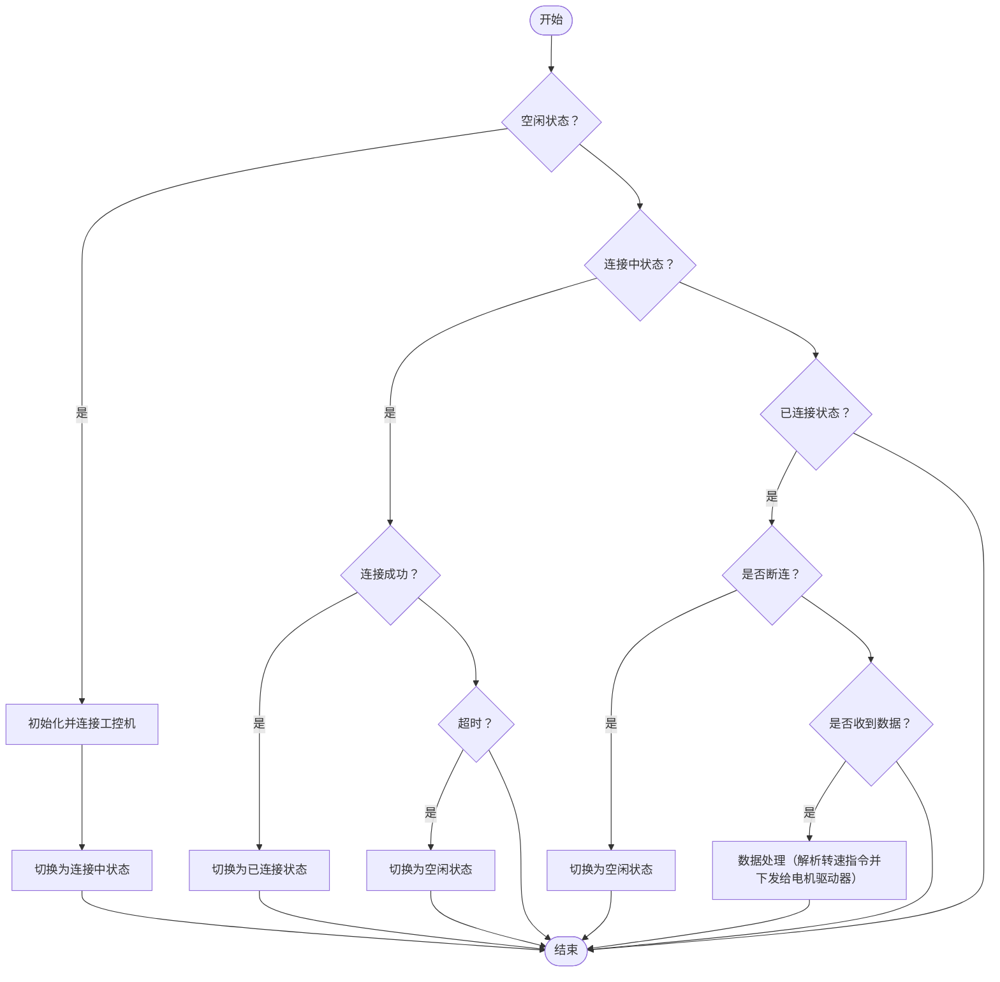

## 概述

ROS（Robot Operating System，机器人操作系统）是一个为机器人软件开发提供的开源框架。它集成了硬件抽象、底层驱动、常用功能实现、消息传递、包管理等功能，支持模块化开发和分布式计算，广泛应用于学术和工业领域的机器人。需要注意的是，虽然它名为操作系统，实质上是个框架，也可简单理解为众多软件的集合。

ROS 中有众多开源组件可供使用，以实现一个机器人应该具备的各种功能，如自主行走、物体位姿识别、运动控制等。本文重点关注其中的自主行走部分。

机器人的自主行走一般涉及到两个部分：建图和导航。建图方面，如今通常使用 SLAM 方式，SLAM 全称是 **Simultaneous Localization and Mapping**，即“同时定位与建图”，它能让机器人在行走过程中自动定位和建图；导航方面，即提供一个对应场景的地图，再给定一个目标地点，机器人就能自主地规划路径，躲避障碍物，到达目标地点。

SLAM 算法有很多，可根据使用的核心传感器分为三大类：视觉 SLAM、激光雷达 SLAM 和多传感器 SLAM。顾名思义，视觉 SLAM（又称 vSLAM）使用从相机和其他图像传感器采集的图像，视觉 SLAM 可以使用普通相机（广角、鱼眼和球形相机）、复眼相机（立体相机和多相机）和 RGB-D 相机（深度相机和 ToF 相机）；激光雷达 SLAM 则使用激光雷达作为核心传感器；多传感器 SLAM 即结合前面两者，以及其他相关的传感器，如 IMU、GPS 等实现 SLAM。详见 [同步定位与地图构建 (SLAM) 概述 - MATLAB & Simulink](https://ww2.mathworks.cn/discovery/slam.html)

本文仅探讨其中的激光雷达 SLAM，因为它相对简单些。对于激光雷达 SLAM，ROS 中支持多种 SLAM 算法，包括 gmapping、cartographer、karto、hector、slam_toolbox 等。其中 gmapping 是 ROS1 中默认的 2D SLAM 算法，slam_toolbox 是 ROS2 中官方推荐的 SLAM 算法，而 cartographer 因为其优秀的工程性、严谨专业的特点，在 ROS1 和 ROS2 中均得到了支持。

导航算法（或者说框架）方面，相比 SLAM 选择就少一些，ROS1 中主要使用 navigation 框架，ROS2 中主要使用 nav2 框架。

本文使用 ROS1 noetic 做的相关尝试，使用的 SLAM 算法主要是 gmapping 和 cartographer，导航算法即 navigation 框架。源码参见 <https://github.com/wsxq2/nav_car/tree/main>


从头构建相关的包是非常麻烦的，我们可以参考现有的包，做一些调整以适配我们的情况，由于我们此次使用的是一个两轮差速小车，所以可参考 [ros-mobile-robots/diffbot]。下面先说明下这个包的相关情况。

[ros-mobile-robots/diffbot]: https://github.com/ros-mobile-robots/diffbot

## diffbot

[ros-mobile-robots/diffbot] 是一个非常不错的参考，一方面它非常契合我们的需求，另一方面它比较严谨且工程化优秀，因为它尽可能地遵循了 [Tutorials/Best Practices - ROS Wiki](https://wiki.ros.org/Tutorials/Best%20Practices) 和相关的 [REP](https://www.ros.org/reps/rep-0000.html)。

强烈建议仔细阅读它的[官方文档](https://ros-mobile-robots.com/)，写得非常详细，很适合入门。

该项目从零实现了差速小车建图和导航所需的全部软件包。文档从硬件部分入手，详细列出了 BOM 清单和硬件框图，重点介绍了主控处理器的选择与配置。随后，系统讲解了各个软件包的创建流程与实现细节，并在最后补充了相关的机器人理论知识，内容详实且结构清晰。

它主要提供了以下包：

- **diffbot_base**：该包包含 ROS Navigation Stack 所需的 base_controller 组件的特定平台代码。它包括基于 rosserial 的 Teensy MCU 固件（对应单片机），以及运行在 SBC（即单板计算机，对应工控机） 上的 C++ 节点，负责实例化 ROS Control 硬件接口（包括 controller_manager 控制循环）。底层 base_controller 组件从硬件读取编码器计数，计算关节的角位置和速度，并将其发布到 ROS Control 硬件接口。通过该接口，可以使用 ROS Control 的 diff_drive_controller 包。它为差速驱动移动底盘提供了一个控制器（DiffDriveController），它可根据遥控节点或 ROS Navigation Stack 接收到的指令（`cmd_vel`）计算目标关节速度（左右轮速度）。计算得到的目标关节速度会传递给底层控制器，并与实际测得的速度进行比较，通过两个独立的 PID 控制器（每个电机一个）计算合适的电机 PWM 信号。
- **diffbot_bringup**：包含用于启动硬件驱动节点（如相机、激光雷达、微控制器等）以及 diffbot_base 包中的 C++ 节点的启动文件，用于真实的机器人。
- **diffbot_control**：包含用于 Gazebo 仿真和实际机器人中 ROS Control 的 DiffDriveController 和 JointStateController 的配置。参数配置通过本包内的启动文件加载到参数服务器。
- **diffbot_gazebo**：为 Diffbot 提供在 Gazebo 仿真器中使用的仿真专用启动和配置文件。
- **diffbot_msgs**：定义了 Diffbot 专用的消息类型，例如编码器数据的消息就在该包中定义。
- **diffbot_navigation**：包含 ROS Navigation Stack 所需的全部配置和启动文件。
- **diffbot_slam**：包含用于 SLAM 的配置，如使用 gmapping、cartographer 等实现环境地图的创建。
- **diffbot_description**: 机器人描述文件，提供 URDF。
- **diffbot_mbf**: Move Base Flex 相关配置和启动文件。Move Base Flex（mbf） 是 ROS 导航（navigation）框架的一个升级版，旨在替代传统的 move_base。
它提供了更灵活、模块化的导航接口，支持插件化的全局规划、本地规划和恢复行为，并且可以更好地与多种机器人平台和导航算法集成。

其中最重要的是 diffbot_base、diffbot_control、diffbot_navigation、diffbot_slam、diffbot_description 这几个包，需要仔细研读。

## 总体框架

### 硬件框图

本次实战使用的硬件对应的框图如下：


说明如下：

- **STM32单片机** 是整个底层控制的核心，负责与电机驱动器、工控机等通信。
- **电机驱动器1** 和 **电机驱动器2** 分别通过 RS485 总线与 STM32 单片机连接，各自控制 **电机1** 和 **电机2**，实现左右轮的独立驱动。
- **STM32单片机** 通过以太网（ETH）与 **工控机** 通信，工控机作为上位机，负责高层控制、算法运行等。
- **激光雷达** 通过以太网（ETH）与工控机连接，提供环境感知数据。
- **遥控手柄无线接收器** 通过 USB 接口与工控机连接，实现遥控手柄与工控机之间的无线通信，便于人工遥控。
- **IMU** 通过 RS232 接口与工控机连接，提供姿态和加速度等传感器数据。
- **WIFI网卡** 通过 USB 接口与工控机连接，实现无线网络通信。
- **工控机** 还通过 USB 与 STM32 单片机连接（用于数据交互或固件升级），并通过 SWD 接口与 STM32 单片机连接（用于调试和下载程序）。

关于硬件型号方面：

- 电机驱动器： [欧艾迪驱动器](https://item.taobao.com/item.htm?id=709417463142)
- 单片机： [科鑫工控板 STM32H750](https://item.taobao.com/item.htm?from=cart&id=767885976386&skuId=5272640669547)
- 工控机： [LCFC联宝 EA-B310](https://www.lcfc.com.cn/AIEndProducts/info.aspx?itemid=2133)
- 激光雷达：[镭神 M10](https://item.taobao.com/item.htm?id=661905067052&skuId=5614444201938)
- IMU：[灵兮 LINS358](https://item.taobao.com/item.htm?id=739030727569&skuId=5862593886245)
- 无线手柄：[轮趣科技 PS2 USB 无线手柄](https://item.taobao.com/item.htm?id=652133230169&skuId=4866644744742)
- WIFI USB 网卡：[安翼科技 驱动款 外置天线双频 1300 兆](https://item.taobao.com/item.htm?id=679222853642&skuId=5047593227396)

### 软件框图

本次实战的软件框架如下图所示：


其中：

- 电机驱动器：负责驱动电机。具体来说，它通过 Modbus RTU 协议和单片机通信，接收单片机的转速指令，转换成对应的电信号，然后下发到电机。两轮差速小车有两个电机，故有两个对应的电机驱动器。
- 单片机：运动控制板。是工控机和电机间沟通的桥梁，一方面，接收来自电机驱动器的状态数据，并发送给工控机，同时从工控机获取转速命令，转发给电机驱动器。
- motor_driver：电机驱动程序。这里也可以理解为一个桥梁，连接单片机和 RobotHW。
- RobotHW：RobotHW 的全称是`hardware_interface::RobotHW`，是 ros_control 组件中需要实现的一个 C++ 接口（根据机器人的设计自行实现），是 ros_control 和真实机器人间的桥梁。本项目中，RobotHW 在 diffbot_base 中实现。
- ros_control：`ros_control` 是 ROS 生态中的一个硬件抽象和控制框架，主要用于机器人底层的运动控制。它提供了标准化的硬件接口和控制器插件机制，方便开发者实现如速度控制、位置控制等功能，并支持多种机器人平台。通过 `ros_control`，可以将上层的运动指令（如 `cmd_vel`）与底层硬件解耦，实现灵活、可拓展的机器人控制系统。ros_control 准备就绪后，就能供建图和导航算法使用了。

关于数据流方面：

- 电机驱动器和单片机之间通过 RS485 连接，使用 Modbus RTU 协议进行通信，单片机可读取和写入数据到驱动器中的指定寄存器，传输内容包括转速下发、实时转速上报、实时位置上报等，这里的实时位置即电机转了多少度。其中，转速的单位为 erpm，位置的单位为 0.01 度。
- 单片机和工控机（motor_driver）之间通过基于 TCP 的自定义协议进行通信，传输内容主要是工控机下发的转速（单位为 0.001 rpm）以及单片机上传的实际转速和位置（单位为 0.001 度），关于该协议的具体内容后面会详细说明。
- motor_driver 和 RobotHW 之间通过 ros topic 通信，传输内容同样是下发的转速（`diffbot_msgs::WheelsCmdStamped`）、上传的实时转速和位置（`sensor_msgs::JointState`），由于是 ROS 格式的，所以它的转速单位为 rad/s，位置单位为 rad。
- RobotHW 和 ros_control 之间通过内部接口通信（即变量赋值），传输的内容同样是转速和位置。
- ros_control 和其他组件之前通过 ros topic 通信，其中包括 `cmd_vel` 、`odom` 等。

另外附上 AI copilot 的解读：

> 这张软件框图展示了差速小车在 ROS 系统下的主要软件与数据流关系：
> 
> - 工控机内部包含多个核心模块：`motor_driver` 负责与底层单片机通信，`RobotHW` 实现硬件抽象接口，`ros_control` 提供标准化的控制器管理，`建图和导航`（如 SLAM、navigation）实现高层功能，`IMU_driver` 和 `lidar_driver` 分别处理 IMU 和激光雷达数据，`遥控手柄`用于人工控制。
> - STM32 单片机与电机驱动器通过底层协议交互，采集原始转速和位置数据，并将其以易于传输的格式发送给 `motor_driver`。
> - `motor_driver` 将数据转换为 ROS 标准格式，传递给 `RobotHW`，再由 `ros_control` 进行进一步处理，实现速度、位置等控制闭环。
> - `ros_control` 接收来自 `建图和导航`、`遥控手柄`等模块的运动指令（如 `cmd_vel`），并将其下发到底层，实现机器人运动控制。
> - 激光雷达和 IMU 的原始数据分别由 `lidar_driver` 和 `IMU_driver`处理，转换为 ROS 消息（如 `scan`、`imu`），供建图和导航模块使用，实现环境感知和定位。
> - 整体数据流清晰，体现了从底层硬件到高层算法的分层解耦设计，便于系统扩展和维护。

可见分析得还挺清楚的，早知道我直接用 AI 了，一开始没想到 :sob:。

下面将由底向上逐步说明如何实现。

## 单片机

> 基于 vscode 的单片机开发环境搭建可参考 [使用 VSCode 打造多平台多语言通用的 IDE —— STM32 应用开发](#stm32-应用开发)
{: .prompt-tip }

首先还是提一下 [ros-mobile-robots/diffbot] 原本的单片机型号和实现方式，它使用的是 Teensy 3.2，关于它的介绍如下：

> Teensy 3.2 是一款基于 ARM Cortex-M4 内核的高性能微控制器开发板，由 PJRC 公司设计。它主频为72MHz，内置64KB RAM和256KB Flash，拥有丰富的数字/模拟接口（如GPIO、PWM、ADC、I2C、SPI、UART等），体积小巧，兼容 Arduino IDE，适合嵌入式开发、机器人控制、音频处理等应用。Teensy 3.2 性能强大、功耗低，广泛用于需要高实时性和多外设支持的场景。
>
> ——引用自 AI

然后单片机和 SBC （树莓派开发板，可类比工控机）间通过串口通信，为了简化架构，它使用了 rosserial 包，它的使用方法如下：

> `rosserial` 的使用主要包括以下步骤：
> 
> 1. 在微控制器（如 Arduino、STM32）上编写并烧录支持 rosserial 的固件代码，代码中包含 ROS 节点、消息发布/订阅等逻辑。
> 2. 在 ROS 主机上安装 `rosserial` 包，并运行对应的桥接节点（如 `rosserial_python` 或 `rosserial_windows`），指定串口设备和波特率。
> 3. 通过串口（如 `/dev/ttyUSB0`）将微控制器与主机连接，主机端桥接节点会自动与微控制器建立 ROS 通信。
> 4. 之后，微控制器就可以像普通 ROS 节点一样发布、订阅消息，实现与 ROS 系统的无缝集成。
> 
> 常用命令示例（以 Arduino 为例）：
> 
> ```bash
> rosrun rosserial_python serial_node.py _port:=/dev/ttyUSB0 _baud:=115200
> ```
>
> 这样即可实现嵌入式设备与 ROS 主机的数据交互。
>
> —— 引用自 AI

除了 rosserial，现在还有个与之类似的但比较新兴的事物—— [micro ROS]，它仅限于 ROS2，以后也可以研究一下。

[micro ROS]: https://micro.ros.org/

现在回到此次实战中来，我们使用的单片机是 STM32H750，和工控机间通过 ETH 通信，没有用 rosserial，用的是基于 TCP 的自定义协议。

此次使用的单片机代码整体流程如下（去掉了业务无关部分，例如 STM32 硬件初始化调用等）：


可以看到主要包括四个部分：电机初始化、状态上报、电机状态机处理、TCP通信状态机处理。下面分别说明。

### 电机初始化（motor_init）

电机初始化主要完成了两个电机驱动器的保持寄存器（可读写的寄存器，如转速控制寄存器）的读取、初始速度和加速度的设置。

其中读取保持寄存器格外重要：由于电机模块使用的是缓存的思想，不但会将所有从驱动器中读出的状态缓存到全局变量中，还会将要写入的转速控制等指令也缓存到另一全局变量中，这两个全局变量统一由“状态机处理函数”去读取和写入相应的值，从全局变量读取的控制指令会下发到驱动器。而控制指令有些是有初始值的，即上电后的默认值，如果不从驱动器中读取出来，而是简单地统一将这些值设置为 0，就可能会出问题。

### 状态上报（core_task）

单片机每 20ms 上报一次实时状态，这里的实时状态主要是指实时转速和实时位置，这两个信息相当于编码器，可据此得到里程计信息（即 odom 主题）

### 电机状态机处理（motor_fsm_process）

该函数流程如下所示：


### TCP 通信状态机处理（tcp_client_poll）

该函数流程如下：



### 代码实现

可以准备提示词（包含上述内容），让 AI 生成初步代码，再做微调，这样会快很多。

### 测试

前述单片机功能实现后，如何验证相关逻辑是否正确？以及代码是否有 bug 呢？

软件开发中，测试通常是一个不被重视的环节，或者说是个缺乏有效方法、尽可能将测试提前的理念的环节。软件测试通常可分为3个步骤：单元测试、集成测试、系统测试。它们是由局部到整体的一个过程，先确保写的模块级代码正确，再考虑模块间联合起来后工作正常，最后再和其他系统联调。大多数人通常直接跳过前两个步骤，直接在系统联调的时候找问题，然后这样效率是非常低的。

STM32 中，单元测试通常比较困难，因为一个模块通常会依赖底层的一些东西，如硬件驱动等，所以较难剥离出来做单元测试。但取决你如何设计模块，有不少情况下是可以设计出能进行单元测试的模块的。如果实在没办法那就只能不进行单元测试。

集成测试相对而言是容易在 STM32 中进行的，比如对于当前的功能需求，对外只能一个以太网接口，且自身是 TCP 客户端，通过三次握手和工控机建立连接并进行通信，使用的是约定好的自定义协议，这样的话我们就可以在自己的开发机中运行一个 TCP 服务端，监听在指定端口，并自行构建“合法报文”（如`AA 55 0F 00 01 00 00 00 00 00 00 00 00 6A 08`等）进行测试。一个可用的工具是 [Zhou-zhi-peng/NetDebugger](https://github.com/Zhou-zhi-peng/NetDebugger)。

这样一来，在系统联调时就会轻松很多。

此外，在测试过程中，需要频繁修改程序并下载到 STM32 中，以验证修改是否正确，一个比较笨的方法是将小车拖到开发机（开发程序的 PC）旁边，然后开发机通过 USB SWD 仿真器直连 STM32 开发板，同时连接其调试串口查看是否正常运行，但是这样拖动非常麻烦，而且有时车已经跑远了。有更好的方法吗？

当然是有的，前面的硬件框图也体现了，让车上的工控机直连单片机，包括 SWD 调试下载接口和 USB 调试串口。这样一来，可以通过 WIFI 远程到工控机，再在工控机中下载程序到 STM32，以及查看它的打印。下面说明下具体需要做哪些事才能实现这一目标：

1. 下载并安装 [stlink-org/stlink](https://github.com/stlink-org/stlink)。根据官方文档 README.md，官方推荐使用 Release 处的下载链接下载安装，而非使用 `sudo apt install stlink-tools` 命令安装。这样安装的版本也较新，否则可能面临奇怪的问题。安装后有三个常用命令：
   1. `st-info`：查看连接的仿真器和 STM32 芯片信息。
   2. `st-util`：gdb server。用于调试。
   3. `st-flash`：用于下载程序到 STM32。**这个是关键**。使用 `st-flash --reset --connect-under-reset write output.bin 0x08000000` 命令即可完成下载。
   
   结合 vscode 如何才能用起来更方便呢？在 [使用 VSCode 打造多平台多语言通用的 IDE —— STM32 应用开发](#stm32-应用开发) 的基础上添加以下文件（如果已经有该文件则补充相应内容进去）：

   ```json
   {
   	"version": "2.0.0",
   	"tasks": [
		  {
		  	"type": "cmake",
		  	"label": "CMake: build",
		  	"command": "build",
		  	"targets": [
		  		"all"
		  	],
		  	"preset": "${command:cmake.activeBuildPresetName}",
		  	"group": "build",
		  	"problemMatcher": [],
		  },
   		{
   			"type": "shell",
   			"label": "generate bin file",
   			"command": "arm-none-eabi-objcopy",
   			"args": [
   				"-O",
   				"binary",
   				"${command:cmake.launchTargetPath}",
   				"output.bin",
   			],
   			"dependsOn": [
   				"CMake: build"
   			]
   		},
   		{
   			"type": "shell",
   			"label": "scp bin file",
   			"command": "pscp",
   			"args": [
   				"-load",
   				"jetson",
   				"output.bin",
   				"wsxq2@192.168.3.114:work/",
   			],
   			"dependsOn": [
   				"generate bin file"
   			]
   		},
   		{
   			"type": "shell",
   			"label": "deploy bin file",
   			"command": "plink",
   			"args": [
   				"-batch",
   				"-load",
   				"jetson",
   				"st-flash",
   				"--reset",
   				"write",
   				"~/work/output.bin",
   				"0x08000000",
   			],
   			"problemMatcher": [],
   			"group": {
   				"kind": "none",
   				"isDefault": false
   			},
   			"dependsOn": [
   				"scp bin file"
   			]
   		}
   	]
   }
   ```
   {: file=".vscode/task.json" }
   
   然后在命令面板中先执行 `Run Tak`，再执行 `deploy bin file` 即可一键编译当前代码并下载到 STM32 开发板中。

2. 安装 [minicom](https://en.wikipedia.org/wiki/Minicom)。minicom 是 Linux 下的一个串口调试工具，用起来还算比较方便。直接通过 `sudo apt install minicom` 命令安装即可。

## motor_driver

> motor_driver 相关代码和启动文件位于 motor_driver 包。
{: .prompt-info }

> 基于 vscode 的 ROS 开发环境搭建可参考 [使用 VSCode 打造多平台多语言通用的 IDE —— ROS 应用开发](#ros-应用开发)
{: .prompt-tip }

### 和单片机的通信协议

该协议是一个自定义协议，当前基于以太网 TCP，事实上，可以基于任何其他接口，如串口。

```c
typedef struct __attribute__((packed))
{
  uint16_t head;        // 帧头
  uint16_t length;      // 帧长
  uint8_t cmd;          // 命令
  int32_t motor_left;   // 左电机转速，单位为 0.001rpm
  int32_t motor_right;  // 右电机转速，单位为 0.001rpm
  uint8_t reset_odom;   // 是否复位里程计，0: 不复位，1: 复位
  uint16_t crc16;       // 校验
} motion_control_frame_t;

typedef struct __attribute__((packed))
{
  uint16_t head;        // 帧头
  uint16_t length;      // 帧长
  uint8_t cmd;          // 命令
  int32_t motor_left;   // 左电机转速，单位为 0.001rpm
  int32_t motor_right;  // 右电机转速，单位为 0.001rpm
  int32_t pos_left;     // 左电机里程，单位为 0.001度
  int32_t pos_right;    // 右电机里程，单位为 0.001度
  uint16_t crc16;       // 校验
} status_query_frame_t;
```

### 输入输出

需要对两个方向的数据流分别分析：

1. 单片机->motor_driver->RobotHW：对于此数据流而言，motor_driver 的输入是前述的 `status_query_frame_t`，输出是 `measured_joint_states` topic（类型为 `sensor_msgs::JointState`）
2. RobotHW->motor_driver->单片机：对于此数据流而言，motor_driver 的输入是 `wheel_cmd_velocities` topic（消息类型为`diffbot_msgs::WheelsCmdStamped`），输出是前述的`motion_control_frame_t`。

### 代码实现

如何快速编写相应的代码呢？答案是使用 AI，比如你可以直接将前述内容喂给 AI，它就能一下子给出代码，当然，肯定还是免不了微调一番，但这样比自己写快多了，而且 AI 的代码设计和质量还比较好。也可以使用类似如下的提示词：

> 我需要写tcp服务器代码，监听地点0.0.0.0，端口号3011，用宏定义，在接收连接后按照以下协议读取：
>
> | 字段          | 功能    | 数据类型  | 字节数 | 字节偏移 | 备注                        |
> |-------------|-------|-------|-----|------|---------------------------|
> | HEAD        | 帧头    | U16   | 2   | 0    | 固定为0x55AA                 |
> | LEN         | 帧长    | U16   | 2   | 2    | 单位为字节，整个帧的长度，不同命令的帧长不同    |
> | CMD         | 命令    | U8    | 1   | 4    | 0x02表示状态上报                |
> | MOTOR_LEFT  | 左电机转速 | INT32 | 4   | 5    | 单位为0.001rpm，向前时应为正        |
> | MOTOR_RIGHT | 右电机转速 | INT32 | 4   | 9    | 单位为0.001rpm，向前时应为正        |
> | POS_LEFT    | 左电机里程 | INT32 | 4   | 13   | 单位为0.001度                 |
> | POS_RIGHT   | 右电机里程 | INT32 | 4   | 17   | 单位为0.001度                 |
> | CRC16       | 校验    | U16   | 2   | 21   | 不包括帧头和自身,采用 MODBUS RTU 算法 |
> 
> 同时发布左右电机转速到 topic `measured_joint_states`（类型为 `sensor_msgs::JointState`）。此外订阅 `wheel_cmd_velocities` topic（消息类型为`diffbot_msgs::WheelsCmdStamped`,可以简单理解为有两个成员的 float32 数组，分别对应两个电机的转速，单位为 rad/s），收到数据后进行单位换算，然后按照以下协议发送到已经连接的 tcp客户端：
> 
> | 字段        | 功能           | 数据类型 | 字节数 | 字节偏移 | 备注                                         |
> | ----------- | -------------- | -------- | ------ | -------- | -------------------------------------------- |
> | HEAD        | 帧头           | U16      | 2      | 0        | 固定为0x55AA                                 |
> | LEN         | 帧长           | U16      | 2      | 2        | 单位为字节，整个帧的长度，不同命令的帧长不同 |
> | CMD         | 命令           | U8       | 1      | 4        | 0x01表示运动控制                             |
> | MOTOR_LEFT  | 左电机转速     | INT32    | 4      | 5        | 单位为0.001rpm,向前时应为正                  |
> | MOTOR_RIGHT | 右电机转速     | INT32    | 4      | 9        | 单位为0.001rpm,向前时应为正                  |
> | RESET_ODOM  | 是否复位里程计 | U8       | 1      | 13       | 0: 不复位，1: 复位                           |
> | CRC16       | 校验           | U16      | 2      | 14       | 不包括帧头和自身,采用 MODBUS RTU 算法        |
> 
> 协议字节序均为大端。需要支持异常处理，网络断开时自动重连，并打印相关日志。使用同步方式实现

然后刷的一下，它就生成出了像模像样的代码，我当时仔细检查了一番，竟然没有发现明显的错误，确实牛逼。需要注意的是，以上提示词和现在的代码已经不符合了，因为后面我改了一些细节，并添加了一些功能，当然过程中也是能用 AI 就用 AI，在改代码、优化代码方面，AI 也非常擅长。不得不说，LLM 真的越来越成熟了，让编程效率提高了很多。
  
### 同步 vs 异步

在实现时，我考虑了两种方式，一种同步的，实现起来比较简单，但性能可能较差，另一种是异步的，实现起来比较复杂，但性能较高。同步的那种不需要额外的类和函数，直接在 main 函数中执行即可，异步则相反。

由于可以使用 AI 生成，我两种方式都试了一下，最后感觉还是异步的好用些，就一直用异步的了。当时我直接让 AI 把先得到的同步的代码转换成异步的，居然也成功了，转换得还不错。

关于同步版本的代码，当时有个地方是我纠结的点，就是主循环中的 `ros::spinOnce` 函数调用这里，感觉不限制速率（`rate.sleep()`）会导致过高的 CPU 占用，限制速率又会导致 ros 的回调处理和 tcp 处理相互影响，导致性能降低。关键代码如下所示：

```c
int main(int argc, char** argv) {
    //...
    while (ros::ok()) {
        ROS_INFO("Waiting for TCP client on %s:%d...", TCP_IP, TCP_PORT);
        tcp::socket socket(io_service);
        boost::system::error_code ec;
        acceptor.accept(socket, ec);
        if (ec) {
            ROS_ERROR("Accept error: %s", ec.message().c_str());
            continue;
        }
        ROS_INFO("TCP client connected.");
        try {
            buffer.clear();
            socket.non_blocking(true); // 设置为非阻塞模式
            while (ros::ok() && socket.is_open()) {
                //读取状态数据并处理，读取完成后进行命令下发动作，具体代码省略……
                ros::spinOnce();
                rate.sleep(); // 增加这一行，降低CPU占用
            }
        } catch (std::exception& e) {
            ROS_ERROR("Socket exception: %s", e.what());
        }
        boost::system::error_code ignore_ec;
        socket.close(ignore_ec);
    }
    return 0;
}
```

如今仔细思考了下，结合刚刚发现的来自 `diffbot_base.cpp` 的灵感，或许可以使用 `ros::AsyncSpinner` 将 ros 回调处理放在另一线程中？类似如下代码:

```c
int main(int argc, char** argv) {
    //...
    ros::AsyncSpinner spinner(1);
    spinner.start();
    while (ros::ok()) {
        ROS_INFO("Waiting for TCP client on %s:%d...", TCP_IP, TCP_PORT);
    //...
    }
}
```

然后将 `ros::spinOnce` 那行调用去掉，这样是不是就完美解决了之前担心的问题？后续可以尝试下。

### 测试

该包的输入输出都非常明确，所以非常容易做集成测试。另一方面，由于其代码比较简单，所以做单元测试的必要性不是很大。做集成测试的关键就是要给它提供输入，以检查其输出，由于它有两个方向的数据流，所以需要分别测试。

对于从上层到单片机的数据流，其输入是 ros topic `wheel_cmd_velocities`（消息类型为`diffbot_msgs::WheelsCmdStamped`），输出是 TCP 报文，输入可由`rostopic pub`命令提供，输出可用前述的网络调试工具或者Wireshark 抓包查看。

对于从单片机到上层的数据流，其输入是 TCP 报文，输出是 ros topic `measured_joint_states`（消息类型为`diffbot_msgs::WheelsCmdStamped`），输入可用前述的网络调试工具提供，输出可用 `rostopic echo` 命令查看。

## RobotHW

> RobotHW 相关代码和配置位于 diffbot_base 包。
{: .prompt-info }

RobotHW 对应的包主要是为了实现 `hardware_interface::RobotHW` 接口，在 ros_control 中，这是非常关键的一个接口。首先我们看一下 ros_control 的框图：


可以看到，ros_control 主要分为 4 大块：

- Controller Manager: 控制器管理器，通过它我们可以管理多个控制器，如我们需要用到的 `joint_state_controller`（类型为`joint_state_controller/JointStateController`） 和 `mobile_base_controller`（类型为 `diff_drive_controller/DiffDriveController`），前者用于发布 `/diffbot/joint_states`，后者用于订阅 `/diffbot/mobile_base_controller/cmd_vel` 并发布 `/diffbot/mobile_base_controller/odom`，`diff_drive_controller`会将整车速度转换为两个轮子的转速，详情参见 [diff_drive_controller - ROS Wiki](https://wiki.ros.org/diff_drive_controller)
- Controller: 有许多类型的控制器，除了上面提到的两种外，还有关节位置控制器、关节速度控制器等。
- `hardware_interface::RobotHW`: 需要用户自行实现的关键接口，是控制器和真实机器人间的桥梁。
- Real Robot: 真实的机器人，包括各种驱动器、执行器、编码器等

这 4 大块中，只有 `hardware_interface::RobotHW` 和 Real Robot 这两部分需要我们自行实现，其它只需要配置好就 ok 了。关于 Real Robot 部分，可以理解为我们新增了一个 motor_driver 在 Real Robot 和 RobotHW 之间，这样的好处是更容易分析和调试，当然也可以选择直接在 RobotHW 中实现 motor_driver 的功能，但这样会比较复杂。

关于 ros_control 的更多信息可参考官方文档：[ros_control - ROS Wiki](https://wiki.ros.org/ros_control)

关于测试方面，RobotHW 不方便做单元测试和集成测试，因为它可以理解为是 ros_control 的一部分，只是需要用户自行实现相关代码，所以我们可以联合 ros_control 一起测试。

此外，需要注意是，最新的 [ros-mobile-robots/diffbot] 版本（1.1.0）中，pid 放在了单片机中去做，不在 RobotHW 里做了（详见 [PID Controllers - DiffBot Differential Drive Mobile Robot](https://ros-mobile-robots.com/packages/diffbot_base/pid/)），我觉得这是一个很好的改动，因为 PID 是为了控制电机的转速稳定在设定值，这对于单片机而言更加擅长，因为它们的实时性更高。当然，在此次实战使用的机器人中，PID 实际是由电机驱动器完成的，减轻了不少工作量（调 PID 挺麻烦的）。

但 [ros-mobile-robots/diffbot] 的源码中还是保留了之前的 PID 相关代码，尤其是还保留了 topic `encoder_ticks`、`motor_left`、`motor_right`。这些在本次实战中均未用上。

## ros_control

> ros_control 相关配置位于 diffbot_control 包。
{: .prompt-info }

这一部分主要是修改配置文件和启动文件，以适配我们的小车。其中最重要的文件是 `diffbot_control.yaml`，其内容如下所示：

```yaml
diffbot:
  # Settings for ros_control hardware interface
  hardware_interface:
     joints:
        - back_left_wheel_joint
        - back_right_wheel_joint
          
  # Publish all joint states -----------------------------------
  joint_state_controller:
    type: joint_state_controller/JointStateController
    publish_rate: 50
    extra_joints:
      - name: rear_caster_rotation_joint
        position: 0.01
        velocity: 0.0
        effort: 0.0
      - name: rear_caster_wheel_joint
        position: 0.01
        velocity: 0.0
        effort: 0.0


  mobile_base_controller:
    type: diff_drive_controller/DiffDriveController
    publish_rate: 50

    left_wheel: 'back_left_wheel_joint'
    right_wheel: 'back_right_wheel_joint'

    # Wheel separation and diameter. These are both optional.
    # diff_drive_controller will attempt to read either one or both from the
    # URDF if not specified as a parameter
    wheel_separation : 0.446
    wheel_radius : 0.16

    # Odometry covariances for the encoder output of the robot. These values should
    # be tuned to your robot's sample odometry data, but these values are a good place
    # to start
    pose_covariance_diagonal: [0.01, 0.01, 0.001, 0.001, 0.001, 0.3]
    twist_covariance_diagonal: [0.01, 0.01, 0.001, 0.001, 0.001, 0.3]

    # Top level frame (link) of the robot description
    base_frame_id: base_footprint

    # Velocity and acceleration limits for the robot
    linear:
      x:
        has_velocity_limits    : true
        max_velocity           : 1.2   # m/s
        has_acceleration_limits: true
        max_acceleration       : 1.0   # m/s^2
    angular:
      z:
        has_velocity_limits    : true
        max_velocity           : 3.14   # rad/s
        has_acceleration_limits: true
        max_acceleration       : 3.14   # rad/s^2

```

可以看到一共有 4 个关节，其中带 caster 的两个关节是附加关节，并不重要，可以不管，剩下的两个关节对应两个轮子，分别说明：

- `back_left_wheel_joint`：左后轮关节，对应左轮电机。
- `back_right_wheel_joint`：右后轮关节，对应右轮电机。

关于 `diff_drive_controller` 的配置说明请参见官方文档 [diff_drive_controller - ROS Wiki](https://wiki.ros.org/diff_drive_controller)。

RobotHW 和 ros_control 均准备好后，就可以进行这两个包的联合测试了。同样地，先明确输入输出，它们有两个方向的数据流，可以简单称之为命令下发和状态上报，对于命令下发，它们的输入是`cmd_vel`，输出是 `wheel_cmd_velocities`，对于状态上报，它们的输入是 `measured_joint_states`，输出是 `odom`。由于都是 ros topic，所以可以使用 `rostopic` 的 `pub` 命令和 `echo` 命令进行验证。

## URDF

> URDF 相关文件位于新增的 nav_car_description 包
{: .prompt-info }

在 ROS 中，要实现建图和导航，URDF 也是非常重要的一部分。URDF（Unified Robot Description Format）是 ROS 中用于描述机器人结构和属性的 XML 格式文件。它可以定义机器人的各个部件、关节、尺寸、质量、惯性、传感器等信息，是机器人仿真、可视化和运动规划等功能的基础。关于 URDF 的详细介绍可参见 [urdf - ROS Wiki](https://wiki.ros.org/urdf)

为了实现更好的模块化和复用性，ROS 引入了 Xacro。Xacro（XML Macros）是 ROS 中用于生成 URDF 文件的宏语言。它通过变量、宏和条件语句简化了复杂或重复的机器人描述，使 URDF 文件更易于维护。关于 Xacro 的详细介绍可参见 [xacro - ROS Wiki](https://wiki.ros.org/xacro)

[ros-mobile-robots/diffbot] 中的 diffbot_description 包做得非常好，通过简单修改 config 目录下的配置文件和主 Xacro 文件，我们很容易实现一个机器人模型，当然是简化版本的。如果要实现和真实的非常一致的模型，还是需要花费不少精力。简化模型对于仿真和实际使用而言都足够了。

比较花时间的是通读并理解其 urdf/include 目录的 xacro 文件，这样才能完全掌握之。此外，测量尺寸也是比较花时间的。

另外，在修改的过程中，发现一个问题，我能否快速预览我的模型效果呢？答案是可以的，使用 vscode 中的 ROS 插件即可，详情参见 [使用 VSCode 打造多平台多语言通用的 IDE —— ROS 插件](#ros-插件)

除了预览，写好的 URDF 如何进一步验证呢？尤其是其中的 link 和 joint 的坐标系，以及相应的 tf 等。可以使用 `roslaunch diffbot_description view_diffbot.launch` 命令查看。

## 传感器标定

在运行建图算法或导航算法前，有一个非常重要的步骤，那就是传感器标定。传感器标定是指什么呢？传感器标定是指通过一定的方法和流程，测量并修正传感器的系统误差，使其输出数据更加准确、可靠。常见的标定内容包括传感器的零点偏差、比例系数、安装位置和方向等。

对于本次用到的机器人来说，传感器标定包括激光雷达、IMU、里程计，传感器参数通常可分为内参和外参，内参即指传感器自身的参数，如精度等，外参即传感器之外的一些相关参数，如安装位置和朝向等。下面将对用到的激光雷达和里程计进行标定说明。

### 激光雷达

#### 内参

> 一般而言，激光雷达出厂时已经标定好内参，我们需要关注的主要是外参标定。当然，如需进一步标定内参（如测距精度、角度误差等），可采用以下方法：
> 
> - 将激光雷达对准已知距离的平面或物体，采集数据并与实际距离对比，可通过在驱动中添加偏移量等方式修正测距偏差。
> - 利用标定板或已知尺寸的物体，分析激光点云的分布，检查角度分辨率和线性误差。
> - 多次测量不同距离和角度，统计误差，必要时通过驱动参数或软件补偿进行修正。
>
> ——引用自 AI

本次实战未标定激光雷达的内参

#### 外参

> 激光雷达的外参标定，主要是确定其在机器人坐标系（如 base_link）下的准确位置和朝向。常用方法如下：
> 
> - 手动测量法：使用卷尺、卡尺等工具，测量激光雷达相对于机器人基准点（如 base_link）的三维位置（x, y, z）和安装角度（roll, pitch, yaw），然后在 URDF 或 tf 配置中填写。
> - 标定板法：将激光雷达对准已知位置和角度的标定板，通过点云或激光数据与实际位置对比，调整参数直到对齐。
> - 软件辅助法：使用如 laser_calibration、calibration_toolkit 等 ROS 工具包，通过采集激光数据和机器人运动数据，自动优化外参参数。
> - 多传感器融合法：结合 IMU、里程计等其他传感器，通过数据融合和优化算法（如激光-里程计联合标定）自动求解外参。
> 
> 外参标定的准确性直接影响激光数据与机器人整体的空间关系，是高精度建图和导航的基础。
> 
> ——引用自 AI

其中手动测量法是最简单且相对可靠的方法（精度要求不高的情况下），也是本次实战采用的方法。


### 里程计

里程计是非常重要的数据源，无论对于建图还是导航都非常重要，此次实战中对这点体会尤其深刻。理论上，里程计应该使用较高精度的轮速传感器（或叫编码器），但由于此次使用的机器人结构受限，无法加装，故使用的是电机和其驱动器提供的来自霍尔传感器的数据，该数据精度较低。里程计的内参可以理解为分辨率，外参同样是和机器人主坐标系间的空间关系（包括位置和朝向两个部分）。

内参方面，该小车的理论上的分辨率为 360 / 23 / 3 = 5.22 度，其中 23 是减速比，3 是磁极对数。线性分辨率为 2 * pi * 16 / 23 / 3 = 1.45 cm，其中 16cm 是轮子的半径。

外参方面，同样采用的是手动测量法进行标定+（使用卷尺）。

#### 实测精度

前进后退（仅给定线速度）：

| 序号 | odom 结果（m） | 卷尺测量结果（m） | 误差（cm） | 误差占比 | 备注 |
| ---- | -------------- | ----------------- | ---------- | -------- | ---- |
| 1    | 3.335          | 3.255             | 8          | 2.46%    | 后退 |
| 2    | 3.268          | 3.188             | 8          | 2.51%    | 后退 |
| 3    | 3.337          | 3.297             | 4          | 1.21%    | 前进 |

其中 **误差占比 = 误差/卷尺测量结果**。另外每次测试前都执行了 `rostopic pub /diffbot/reset_odom std_msgs/Empty -1` 了的（该命令用于清除里程计数据，其中的 `-1` 表示只发布一次）

原地旋转（仅给定角速度，初始 odom 为 0）：

| 序号 | odom 结果（°） | 目测结果（°） | 误差（°） | 误差占比 | 备注                              |
| ---- | -------------- | ------------- | --------- | -------- | --------------------------------- |
| 1    | -15.333        | 360           | 15.3      | 4.25%    | 第一次右旋转                      |
| 2    | -30.855        | 360           | 15.5      | 4.30%    | 第二次右旋转（在第 1 次的基础上） |
| 3    | -7.15          | 360 多一点    | ?         | ?        | 左旋转（在第 2 次的基础上）       |
| 4    | -2.18          | 360           | ?         | ?        | 左旋转（在第 2 次的基础上）       |

注：由于 `rostopic echo /diffbot/mobile_base_controller/odom` 命令显示的角度信息不直观（四元数），故测试时使用的以下命令进行的观察：`rosrun tf tf_echo odom base_footprint`，该命令展示的旋转变换有三种表示：四元数、RPY（单位为 rad）、RPY（单位为 °），其中单位为 ° 的 RPY 就比较直观。当然，通过坐标系分析，容易得知以上两个命令的输出是等价的。

注意，其中 odom 结果为 -15.333 表示 odom 认为转了 360 + 15.333 = 375.333 度。因为实测后发现，在右旋转时，odom 中角度的变化规律是 0 -> -90 -> -180(+180) -> +90 -> 0。

## 坐标系变换

无论是建图还是导航，坐标系变换都是非常重要的环节，ROS 中使用 tf 来表达变换，所有用到变换的节点都会订阅 `/tf` 主题，内部使用 tf2 库处理。因此，和其他常见的 topic 不同，`/tf`有非常多的订阅者和发布者（常见 topic 如 `/cmd_vel` 通常只有一个发布者和订阅者）。`/tf` 主题的消息格式见 [tf/tfMessage Documentation](https://docs.ros.org/en/noetic/api/tf/html/msg/tfMessage.html)，除了常规的时间戳外，核心就是表达平移和旋转的 Transform 格式，其中的旋转使用四元数来表达，四元数和旋转矩阵、欧拉角是等价的。

需要注意的是，ROS 中的 TF 是先平移再旋转，旋转的顺序有两种理解方式：内旋（intrinsic rotations）和外旋（extrinsic rotations）。内旋是以当前坐标系作为参考坐标系进行旋转，外旋是以旋转前的坐标系作为参考坐标系进行旋转。那么对于 ROS 中的 tf 变换的旋转表达，将四元数格式转换成 RPY 格式（RPY 分别对应绕 X、Y、Z 轴旋转）后，如果采用外旋方式，则是 XYZ 的顺序，如果采用内旋方式，则是 ZYX 的顺序（即反过来）。举个例子：如果 RPY 格式为 `10°,30°,50°`：
- 如果采用外旋方式：先绕 X 轴旋转 10°，再绕旋转前的 Y 轴旋转 30°，最后绕旋转前的 Z 轴旋转 50°。
- 如果采用内旋方式：先绕 Z 轴旋转 10°，再绕旋转后的 Y 轴旋转 30°，最后绕上次旋转后的 X 轴旋转 50°。

这两种方式是等价的，虽然给人的感觉有点难以置信，但事实就是如此。详情可参见以下链接：

- [欧拉角 - 维基百科，自由的百科全书](https://zh.wikipedia.org/wiki/%E6%AC%A7%E6%8B%89%E8%A7%92#%E5%8B%95%E6%85%8B%E7%9A%84%E5%AE%9A%E7%BE%A9)
- [tf坐标系旋转平移问题（欧拉角、内部旋转、外部旋转）_ros欧拉角中是内旋还是外旋-CSDN博客](https://blog.csdn.net/weixin_47047999/article/details/119045022)
- [Euler angles - Wikipedia](https://en.wikipedia.org/wiki/Euler_angles#Definition_by_intrinsic_rotations)

在建图和导航中，有三个最重要的坐标系：`map`, `odom`, `base_link`（或者`base_footprint`）。下面详细介绍下：

- `map`：地图坐标系，坐标系原点通常为小车的起点，朝向通常和`odom`一致
- `odom`：里程计坐标系，原点通常也为小车的起点，朝向通常和`base_link`一致
- `base_link`：小车底盘坐标系，原点通常为小车底盘的几何中心，朝向通常为：前方为 x 轴正向，左方为 y 轴正向，上方为 z 轴正向，即[笛卡儿右手坐标系](https://zh.wikipedia.org/wiki/%E7%AC%9B%E5%8D%A1%E5%84%BF%E5%9D%90%E6%A0%87%E7%B3%BB#%E4%B8%89%E7%B6%AD%E7%A9%BA%E9%96%93)。

可以看到，一开始`map`和`odom`两个坐标系是重叠的，随着小车的移动（即`base_link`坐标系在运动），`map->lase_link`和`odom->base_link`这两个变换都在发生变化，二者都实现了定位功能，前者通常由 SLAM 中的定位算法提供（或者 AMCL 定位算法），后者通常由里程计（也叫编码器、轮速仪）提供， 由于里程计通常有累计误差，而定位算法通常还结合了其他传感器的数据（如激光雷达），所以通常比里程计得出的变换更加准确，也就是说`map->base_link`通常会比`odom->base_link`更可靠。

问题来了，前面提到的两个变换都会变换到`base_link`坐标系，相当于`base_link`有两个父节点，这是不符合 TF 树规则的，因此为了解决这个问题，且让坐标变换更清晰，引入了`map->odom`的变换，去掉了`map->base_link`的变换，这样一来 TF 树就变成了`map->odom->base_link`的形式，因此也能得到`map->base_link`的变换。

在建图算法中，通常会由算法本身提供`map->odom`的变换，这也是其定位模块的输出（有的还会单独提供发布 Pose 消息的主题作为输出），如果该算法使用了里程计的数据，则通常会将`odom->base_link`的变换作为输入（有的算法或许不会使用该变换，而选择使用 `/odom` 主题，但通常而言，它们是等价的）。算法的官方文档中通常会指出其依赖的 TF 变换和输出的 TF 变换，例如 [Cartographer](https://google-cartographer-ros.readthedocs.io/en/latest/ros_api.html#required-tf-transforms)

## SLAM

> SLAM 相关配置和启动文件位于 diffbot_slam 包
{: .prompt-info }

### gmapping

gmapping 是 ROS1 中常用的 2D 激光 SLAM 算法包，基于 Rao-Blackwellized 粒子滤波（RBPF）方法。它能够让机器人在未知环境中通过激光雷达数据实时构建地图并进行自身定位，具有实现简单、效果稳定等优点，是 ROS1 默认的激光 SLAM 方案。详见 [gmapping - ROS Wiki](https://wiki.ros.org/gmapping)

若要使用 gmapping 算法建图，主要需要修改 `diffbot_slam/config/gmapping_params.yaml`{: .filepath }，这是 gmapping 的参数文件，修改它会影响建图效果，下面简单说明下几个修改过的关键参数：

- `map_update_interval`: 从原本的 2.0 改为了 0.5，以提高 RVIZ 中地图刷新频率
- `maxUrange`: 从原本的 3.0 改为了 20，因为我们使用的激光雷达是 M10，距离最大可到 25m，这里我们保守一点设置为 20m
- `linearUpdate`: 从原本的 1.0 改为了 0.1
- `angularUpdate`: 从原本的 0.2 改为了 0.1
- `xmin`: 从原本的 -10.0 改为了 -20.0
- `ymin`: 从原本的 -10.0 改为了 -20.0
- `xmax`: 从原本的 10.0 改为了 20.0
- `ymax`: 从原本的 10.0 改为了 20.0

以上几个参数的说明如下：

- `map_update_interval`：地图更新的时间间隔（单位：秒）。该参数决定了地图数据多久刷新一次，数值越小，RViz 中地图显示越实时，但会增加计算负担。
- `maxUrange`：激光雷达的最大有效测量距离（单位：米）。应设置为略小于激光雷达的最大量程，超出该距离的点会被忽略。
- `linearUpdate`：机器人每移动多少米后，触发一次地图更新。数值越小，地图更新越频繁，适合对精度要求高的场景。
- `angularUpdate`：机器人每旋转多少弧度后，触发一次地图更新。数值越小，转动时地图更新越频繁。
- `xmin`、`ymin`、`xmax`、`ymax`：地图的边界范围（单位：米）。分别表示地图在 x、y 方向的最小和最大值，决定了地图的整体尺寸。应根据实际场地大小合理设置，范围过小可能导致机器人走出地图边界，过大则浪费内存和计算资源。

关于参数的详细说明可以咨询 AI（如 Copilot），到此为什么没提官方文档的相应章节，因为我没有找到 :joy:

### cartographer

cartographer 是 Google 开源的高性能 SLAM 算法库，支持 2D 和 3D 激光 SLAM。它结合了激光雷达、IMU、里程计等多种传感器数据，能够实现高精度的实时定位与建图。cartographer 以其工程性强、鲁棒性高、支持多平台等特点，在 ROS1 和 ROS2 中均有广泛应用。详见 [Cartographer ROS Integration — Cartographer ROS documentation](https://google-cartographer-ros.readthedocs.io/en/latest/) 和 [Cartographer — Cartographer documentation](https://google-cartographer.readthedocs.io/en/latest/)

cartographer 可以选择性的使用各种传感器，只有激光雷达是必须项，其他都是可选的。如果没有里程计，则可以由 [cartographer_node](https://google-cartographer-ros.readthedocs.io/en/latest/ros_api.html#provided-tf-transforms) 来发布 `odom->base_link` 的 TF 变换（使用激光雷达数据得出里程计信息），相反，如果有里程计，则需要设置 `provide_odom_frame` 为 `false`。此次实战有里程计。

cartographer 使用 lua 文件作为参数配置文件，[ros-mobile-robots/diffbot] 中使用 `diffbot_slam/config/diffbot_lds_2d.lua`{: .filepath} 作为默认配置文件，主要做了以下修改（diff 格式）：

```diff
diff --git a/diffbot_slam/config/diffbot_lds_2d.lua b/diffbot_slam/config/diffbot_lds_2d.lua
index 50484da..f7d293c 100644
--- a/diffbot_slam/config/diffbot_lds_2d.lua
+++ b/diffbot_slam/config/diffbot_lds_2d.lua
@@ -19,7 +19,7 @@ options = {
   map_builder = MAP_BUILDER,
   trajectory_builder = TRAJECTORY_BUILDER,
   map_frame = "map",
-  tracking_frame = "imu_link", -- imu_link, If you are using gazebo, use 'base_footprint' (libgazebo_ros_imu's bug)
+  tracking_frame = "base_footprint", -- imu_link, If you are using gazebo, use 'base_footprint' (libgazebo_ros_imu's bug)
   published_frame = "odom",
   odom_frame = "odom",
   provide_odom_frame = false,
@@ -33,21 +33,23 @@ options = {
   num_point_clouds = 0,
   lookup_transform_timeout_sec = 0.2,
   submap_publish_period_sec = 0.3,
-  pose_publish_period_sec = 5e-3,
-  trajectory_publish_period_sec = 30e-3,
-  rangefinder_sampling_ratio = 1.,
-  odometry_sampling_ratio = 0.1,
-  fixed_frame_pose_sampling_ratio = 1.,
+  pose_publish_period_sec = 5e-2,
+  trajectory_publish_period_sec = 30e-2,
+  rangefinder_sampling_ratio = 0.5,
+  odometry_sampling_ratio = 0.2, -- 50 * 0.2 = 10 Hz
+  fixed_frame_pose_sampling_ratio = 0.5,
   imu_sampling_ratio = 0.1,
   landmarks_sampling_ratio = 1.,
 }
 
 MAP_BUILDER.use_trajectory_builder_2d = true
 
-TRAJECTORY_BUILDER_2D.min_range = 0.1
-TRAJECTORY_BUILDER_2D.max_range = 3.5
-TRAJECTORY_BUILDER_2D.missing_data_ray_length = 3.
-TRAJECTORY_BUILDER_2D.use_imu_data = true
+TRAJECTORY_BUILDER_2D.num_accumulated_range_data = 1
+TRAJECTORY_BUILDER_2D.submaps.num_range_data = 35
+TRAJECTORY_BUILDER_2D.min_range = 0.5
+TRAJECTORY_BUILDER_2D.max_range = 25.
+TRAJECTORY_BUILDER_2D.missing_data_ray_length = 20.
+TRAJECTORY_BUILDER_2D.use_imu_data = false
 TRAJECTORY_BUILDER_2D.use_online_correlative_scan_matching = true
 TRAJECTORY_BUILDER_2D.motion_filter.max_angle_radians = math.rad(0.1)
```

解释如下：

1. **tracking_frame 从 "imu_link" 改为 "base_footprint"**  
   - 解释：没有用到 IMU，故不存在 `imu_link`

2. **pose_publish_period_sec 和 trajectory_publish_period_sec 增大**  
   - 由 5ms/30ms 改为 50ms/300ms，减少了位姿和轨迹的发布频率 
   - 解释：适当降低发布频率可以减轻系统负担，减少不必要的数据流量，同时对 SLAM 效果影响较小。

3. **rangefinder_sampling_ratio、odometry_sampling_ratio、fixed_frame_pose_sampling_ratio 调整**  
   - rangefinder_sampling_ratio 从 1.0 降为 0.5，odometry_sampling_ratio 从 0.1 升为 0.2，fixed_frame_pose_sampling_ratio 从 1.0 降为 0.5。  
   - 解释：这些采样率参数决定了各类传感器数据被 cartographer 处理的比例。适当调整可以平衡数据处理压力和 SLAM 精度。例如，odometry_sampling_ratio=0.2 表示 50Hz 输入频率下，cartographer 以 10Hz 处理里程计数据。

4. **IMU 相关参数调整**  
   - use_imu_data 从 true 改为 false。  
   - 解释：禁用 IMU 数据，适用于没有 IMU 或 IMU 数据质量不佳的场景，或仿真环境下不需要 IMU。

5. **激光参数调整**  
   - min_range 从 0.1 升为 0.5，max_range 从 3.5 升为 25.0，missing_data_ray_length 从 3.0 升为 20.0。  
   - 解释：这些参数根据实际激光雷达的量程进行调整，使 SLAM 能更好地利用激光数据，适应更大空间的建图需求。

6. **num_accumulated_range_data 和 submaps.num_range_data 新增/调整**  
   - num_accumulated_range_data=1，submaps.num_range_data=35。  
   - 解释：控制每次处理多少帧激光数据以及每个子地图包含的激光帧数，影响建图的实时性和精度。

**关于 cartographer 是否需要修改源码的问题**：个人认为不需要，现在需要修改源码的需求主要体现两个方面：全局定位初始化和 RVIZ 中手动定位（订阅 /initialpose 主题）。对于前者，目前主流的修改方案（如[给 Cartographer 添加全局重定位功能 - 哔哩哔哩](https://www.bilibili.com/opus/826735347140395032)，其相应代码位于 [wudiyidashi/cartographer_ws at 28e3cedb9fa75028c921c95f747cfbdcfd243dd4](https://github.com/wudiyidashi/cartographer_ws/tree/28e3cedb9fa75028c921c95f747cfbdcfd243dd4)）效果似乎并没有比其内置的自动重定位机制好（待深入验证），对于后者，这个功能可以通过调用服务`start_trajectory`实现，该服务可以传入初始位姿，所以可自行实现一个节点处理，订阅 RVIZ 发布的 `/initialpose`话题，并调用该服务传入初始位姿，例如[Python script to set initial pose for pure-localization via rviz · Issue #1652 · cartographer-project/cartographer_ros](https://github.com/cartographer-project/cartographer_ros/issues/1652)。不修改源码的话，维护起来会更简单，因为这样不会引入新的问题，也不需要对其版本跟踪，大大降低了不必要的关注度。其他相关链接如下：

- [Localization in Existing Map · Issue #95 · cartographer-project/cartographer_ros](https://github.com/cartographer-project/cartographer_ros/issues/95)
- [Initial Pose to Localization and additional sensors integration](https://groups.google.com/g/google-cartographer/c/dqgz9CNCPKA?pli=1)
- [please add support for an initial world pose · Issue #469 · cartographer-project/cartographer](https://github.com/cartographer-project/cartographer/issues/469)
- [Initial pose implementation. by cschuet · Pull Request #606 · cartographer-project/cartographer](https://github.com/cartographer-project/cartographer/pull/606)
- [Start a new trajectory with an initial pose from /initalpose topic for compatibility for ROS api in purelocalization mode by doisyg · Pull Request #637 · cartographer-project/cartographer_ros](https://github.com/cartographer-project/cartographer_ros/pull/637)
- [Add function to set the initial pose from RVIZ for pure localization mode by tongtybj · Pull Request #1284 · cartographer-project/cartographer_ros](https://github.com/cartographer-project/cartographer_ros/pull/1284)

> 一些检索思路：在 [cartographer-project/cartographer_ros](https://github.com/cartographer-project/cartographer_ros) 和 [cartographer-project/cartographer](https://github.com/cartographer-project/cartographer) 中搜索 `rviz`、`initialpose`、`PerformGlobalLocalization`等关键字，可以快速找到相关代码、issue、MR，且讨论得比较深入
{: .prompt-tip }

## navigation

> navigation 相关配置和启动文件位于 diffbot_navigation 包
{: .prompt-info }

navigation 框架是 ROS1 中用于实现移动机器人自主导航的核心软件包集合。它集成了路径规划、定位、避障、地图管理等功能，能够让机器人在已知或未知环境中根据目标点自动规划路径并安全移动。主要组件包括全局规划器（如 Dijkstra、A*）、局部规划器（如 DWA）、代价地图（costmap）、AMCL 定位等。通过配置和组合这些模块，开发者可以快速实现机器人自主导航功能。详见 [navigation - ROS Wiki](https://wiki.ros.org/navigation)

由于 navigation 框架由多个模块组成，故其配置也较为复杂，在 [ros-mobile-robots/diffbot] 中，`move_base.launch`用到了以下配置文件（位于 `diffbot_navigation/config`{: .filepath} 目录中）：

- `costmap_global_params.yaml`：配置全局代价地图（global costmap）的参数，主要用于全局路径规划，包含地图尺寸、分辨率、障碍物层设置等。
- `dwa_local_planner_params.yaml`：配置 DWA（Dynamic Window Approach）局部规划器的参数，涉及速度、加速度、采样、目标打分等，用于实现机器人在局部范围内的避障和路径跟踪。
- `costmap_common_params.yaml`：全局和局部代价地图的通用参数配置文件，定义了传感器数据源、障碍物层、膨胀层等通用设置。
- `costmap_local_params.yaml`：配置局部代价地图（local costmap）的参数，主要用于局部避障和短距离路径规划，关注机器人周围的动态环境。
- `move_base_params.yaml`：配置 `move_base` 节点的参数，包含全局/局部规划器的选择、恢复行为、控制频率等，是导航功能的核心调度配置文件。

主要修改如下（同样是 diff 格式）：

```diff
diff --git a/diffbot_navigation/config/costmap_common_params.yaml b/diffbot_navigation/config/costmap_common_params.yaml
index f9cb83f..9531600 100644
--- a/diffbot_navigation/config/costmap_common_params.yaml
+++ b/diffbot_navigation/config/costmap_common_params.yaml
@@ -1,20 +1,20 @@
 # http://wiki.ros.org/costmap_2d/flat
 # The default maximum distance from the robot at which an obstacle will be inserted into the cost map in meters.
 # This can be over-ridden on a per-sensor basis.
-obstacle_range: 3.0
+obstacle_range: 20.0
 # The default range in meters at which to raytrace out obstacles from the map using sensor data. 
 # This can be over-ridden on a per-sensor basis.
-raytrace_range: 3.5
+raytrace_range: 22.0
 
 # The footprint of the robot specified in the robot_base_frame coordinate frame as a list in the format: 
 # [ [x1, y1], [x2, y2], ...., [xn, yn] ]. The footprint specification assumes the center point of the robot is at 
 # (0.0, 0.0) in the robot_base_frame and that the points are specified in meters, 
 # both clockwise and counter-clockwise orderings of points are supported.
-footprint: [[-0.08, -0.075], [-0.08, 0.075], [0.105, 0.075], [0.105, -0.075]]
+footprint: [[-0.425, -0.370], [-0.425, 0.370], [0.475, 0.370], [0.475, -0.370]]
 #robot_radius: 0.17
 
 # The radius in meters to which the map inflates obstacle cost values.
-inflation_radius: 0.5
+inflation_radius: 0.3
 # A scaling factor to apply to cost values during inflation. 
 # The cost function is computed as follows for all cells in the costmap further than the inscribed radius distance and 
 # closer than the inflation radius distance away from an actual obstacle: 
@@ -33,4 +33,4 @@ map_type: costmap
 observation_sources: scan
 # Definition of the "scan" observation source. Make sure to set the sensor_frame to the same 
 # name of the laser frame link that is defined in the robot_description. Otherwise the local costamp won't work.
-scan: {sensor_frame: rplidar_laser_link, data_type: LaserScan, topic: diffbot/scan, marking: true, clearing: true}
\ No newline at end of file
+scan: {sensor_frame: lslidar_laser_link, data_type: LaserScan, topic: diffbot/scan, marking: true, clearing: true}
\ No newline at end of file
diff --git a/diffbot_navigation/config/costmap_local_params.yaml b/diffbot_navigation/config/costmap_local_params.yaml
index e43a51b..1a4ec82 100644
--- a/diffbot_navigation/config/costmap_local_params.yaml
+++ b/diffbot_navigation/config/costmap_local_params.yaml
@@ -1,7 +1,7 @@
 # http://wiki.ros.org/costmap_2d/flat
 local_costmap:
   # The global frame for the costmap to operate in.
-  global_frame: odom
+  global_frame: map
   # The name of the frame for the base link of the robot.
   robot_base_frame: base_footprint
```

主要针对代价地图（costmap）的参数配置进行了修改，具体解释如下：

1. `costmap_common_params.yaml` 的修改

   - **obstacle_range: 3.0 → 20.0**
     - 解释：将障碍物检测的最大距离从 3 米提升到 20 米，使机器人能够感知和考虑更远距离的障碍物，适应更大空间或更远距离的激光雷达。

   - **raytrace_range: 3.5 → 22.0**
     - 解释：将射线清除障碍物的最大距离从 3.5 米提升到 22 米，配合更远距离的激光雷达数据，提升地图的清理和更新范围。

   - **footprint: [[-0.08, -0.075], [-0.08, 0.075], [0.105, 0.075], [0.105, -0.075]] → [[-0.425, -0.370], [-0.425, 0.370], [0.475, 0.370], [0.475, -0.370]]**
     - 解释：将机器人轮廓（footprint）由较小的矩形调整为更大尺寸，反映了实际机器人底盘的真实物理尺寸，有助于更准确地避障和路径规划。

   - **inflation_radius: 0.5 → 0.3**
     - 解释：缩小障碍物膨胀半径，使障碍物周围的安全区变小，适合空间较窄或对通过性要求更高的场景。

   - **scan: {sensor_frame: rplidar_laser_link, ...} → scan: {sensor_frame: lslidar_laser_link, ...}**
     - 解释：将激光雷达的传感器坐标系从 `rplidar_laser_link` 改为 `lslidar_laser_link`，以适配实际使用的激光雷达型号，确保数据帧名称与机器人描述一致。

2. `costmap_local_params.yaml` 的修改

   - **global_frame: odom → map**
     - 解释：将局部代价地图的全局参考坐标系从 `odom` 改为 `map`，这样局部代价地图会以全局地图为参考，通常有助于提升定位和路径规划的全局一致性，适合定位精度较高或需要全局一致性的场景。事实上，**修改这里的根本原因是因为使用 `odom` 进行导航时会报错 `Extrapolation Error:...`，以致无法正常工作**。
     
导航框架调参的细节可参考 [navigation/Tutorials/Navigation Tuning Guide - ROS Wiki](https://wiki.ros.org/navigation/Tutorials/Navigation%20Tuning%20Guide) 和 [teddyluo/ROSNavGuide-Chinese](https://github.com/teddyluo/ROSNavGuide-Chinese)

## 仿真

### 简介

> ROS 仿真的好处包括：
> 
> - 可以在没有真实硬件的情况下开发和测试机器人算法，节省成本和时间。
> - 支持快速迭代，方便调试和验证新功能，降低硬件损坏风险。
> - 能模拟各种复杂环境和极端场景，提升算法的鲁棒性和适应性。
> - 便于团队协作和成果复现，促进算法共享和交流。
> - 支持与真实机器人无缝切换，缩短从仿真到实际部署的周期。
>
> ——引用自 AI

ROS 中仿真物理世界通常使用 [gazebo](https://wiki.ros.org/simulator_gazebo)

> Gazebo 是一个开源的三维机器人仿真平台，广泛用于机器人算法开发、测试和验证。它支持物理引擎、传感器仿真、环境建模和多机器人系统，能够真实还原机器人在复杂环境中的运动和交互。Gazebo 与 ROS 深度集成，支持通过插件与 ROS 节点通信，是机器人仿真和虚拟测试的主流工具之一。
>
> ——引用自 AI

关于 ROS 相关的 gazebo 的插件可参见 [gazebo_plugins - ROS Wiki](https://wiki.ros.org/gazebo_plugins?distro=noetic)

> gazebo 已经升级换代了，以前的 gazebo 将被命名为 gazebo classic，新的 gazebo 会有一个后缀，类似于 ros noetic 中的 noetic。未升级的话会经常在命令行和打开 GUI 时提示。但是升级看起来也不简单（详见 [Gazebo Classic Migration — Gazebo ionic documentation](https://gazebosim.org/docs/latest/gazebo_classic_migration/)），就暂且没管。
{: .prompt-tip }

### 分析

原本的 [ros-mobile-robots/diffbot] 对 gazebo 仿真支持得非常好，因此，对于我们搭建的这个新平台，也希望能实现仿真。

> 在 ROS 中仿真差速小车并实现运动控制，通常需要完成以下步骤：
> 
> - 准备小车的 URDF/Xacro 机器人模型，描述其结构、关节、轮子等信息。
> - 配置 Gazebo 插件（如 gazebo_ros_control），使模型支持物理仿真和控制接口。
> - 编写或修改控制器配置（如 diff_drive_controller），实现对轮子的速度/位置控制。
> - 配置并启动 ros_control 框架，加载相应的控制器。
> - 在 Gazebo 中加载小车模型，启动仿真环境。
> - 通过发布 `cmd_vel` 等 ROS 话题，实现小车的运动指令下发和控制。
> - 可选：配置传感器仿真（如激光雷达、IMU）和导航/建图功能，进行更复杂的仿真测试。
> 
> 这样即可在 ROS+Gazebo 环境下实现差速小车的仿真与运动控制。
>
> ——引用自 AI

其中关于 ros_control 的配置是重中之重，在仿真时其整体框图如下（其中还有和真实硬件的对比）：


上图来自 [Gazebo : Tutorial : ROS control](https://classic.gazebosim.org/tutorials?tut=ros_control)

可以看到，和真实硬件不同的地方在于，仿真需要实现的是 `hardware_interface::RobotHWSim` 接口而不是 `hardware_interface::RobotHW`。幸运的是，官方提供了默认的 `hardware_interface::RobotHWSim` 实现，其名为 `gazebo_ros_control/DefaultRobotHWSim`，所以可以写这样的 xacro：

```xml
  <xacro:macro name="gazebo_ros_control" params="robotNamespace robotSimType:=gazebo_ros_control/DefaultRobotHWSim"> 
    <gazebo>
      <plugin name="gazebo_ros_control" filename="libgazebo_ros_control.so">
        <robotNamespace>${robotNamespace}</robotNamespace>
        <!--robotParam>/robot_description</robotParam-->
        <robotSimType>${robotSimType}</robotSimType>
      </plugin>
    </gazebo>
  </xacro:macro>
```

调用时：

```xml
  <xacro:gazebo_ros_control robotNamespace="/diffbot" />
```

关于 `gazebo_ros_control/DefaultRobotHWSim` 的代码实现可参见 [gazebo_ros_pkgs/gazebo_ros_control/src/default_robot_hw_sim.cpp at noetic-devel · ros-simulation/gazebo_ros_pkgs](https://github.com/ros-simulation/gazebo_ros_pkgs/blob/noetic-devel/gazebo_ros_control/src/default_robot_hw_sim.cpp#L261)

### 修改

具体而言，为了尝试仿真，主要做了以下修改：

```diff
diff --git a/diffbot_control/launch/diffbot.launch b/diffbot_control/launch/diffbot.launch
index 518169d..417c177 100644
--- a/diffbot_control/launch/diffbot.launch
+++ b/diffbot_control/launch/diffbot.launch
@@ -1,6 +1,6 @@
 <launch>
     <!--arg name="model" default="$(env DIFFBOT_MODEL)" doc="model type [diffbot, remo]"/-->
-    <arg name="model" default="diffbot" doc="model type [diffbot, remo]"/>
+    <arg name="model" default="nav_car" doc="model type [diffbot, remo, nav_car]"/>
     <arg name="rvizconfig" default="$(find diffbot_control)/rviz/diffbot.rviz" />
     <arg name="world_name" default="$(find diffbot_gazebo)/worlds/db_world.world"/>
 
diff --git a/diffbot_description/launch/view_diffbot.launch b/diffbot_description/launch/view_diffbot.launch
index 13e9541..3e5ec23 100644
--- a/diffbot_description/launch/view_diffbot.launch
+++ b/diffbot_description/launch/view_diffbot.launch
@@ -1,7 +1,8 @@
 <launch>
-    <arg name="model" />
+    <arg name="model" default="nav_car" doc="model type [diffbot, remo, nav_car]"/>
+    <arg name="description_package" default="$(eval find(arg('model') + '_description'))" />
     <!-- Parsing xacro and setting robot_description parameter -->
-    <param name="robot_description" command="$(find xacro)/xacro $(find diffbot_description)/urdf/diffbot.urdf.xacro" />
+    <param name="robot_description" command="$(find xacro)/xacro --inorder '$(arg description_package)/urdf/$(arg model).urdf.xacro'" />
     <!-- Setting gui parameter to true for display joint slider -->
     <!-- param name="use_gui" value="true"/ -->
     <!-- Starting Joint state publisher node which will publish the joint values -->
diff --git a/diffbot_gazebo/launch/diffbot_view.launch b/diffbot_gazebo/launch/diffbot_view.launch
index c7bd174..5ca19b5 100644
--- a/diffbot_gazebo/launch/diffbot_view.launch
+++ b/diffbot_gazebo/launch/diffbot_view.launch
@@ -1,7 +1,7 @@
  <launch>
   <!-- these are the arguments you can pass this launch file, for example paused:=true -->
   <!--arg name="model" default="$(env DIFFBOT_MODEL)" doc="model type [diffbot, remo]"/-->
-  <arg name="model" default="diffbot" doc="model type [diffbot, remo]"/>
+  <arg name="model" default="nav_car" doc="model type [diffbot, remo]"/>
   <arg name="description_package" default="$(eval find(arg('model') + '_description'))" />
   <arg name="urdf_file" default="$(find xacro)/xacro '$(arg description_package)/urdf/$(arg model).urdf.xacro'" />
 
diff --git a/diffbot_gazebo/worlds/db_world.world b/diffbot_gazebo/worlds/db_world.world
index 19480ef..05a0a83 100644
--- a/diffbot_gazebo/worlds/db_world.world
+++ b/diffbot_gazebo/worlds/db_world.world
@@ -33,7 +33,7 @@
 
     <!-- Load world -->
     <include>
-      <uri>model://db_world</uri>
+      <uri>model://custom</uri>
     </include>
 
     <scene>
diff --git a/nav_car_description/urdf/include/robot.gazebo.xacro b/nav_car_description/urdf/include/robot.gazebo.xacro
new file mode 100644
index 0000000..37ca276
--- /dev/null
+++ b/nav_car_description/urdf/include/robot.gazebo.xacro
@@ -0,0 +1,36 @@
+<?xml version="1.0"?>
+<robot xmlns:xacro="http://ros.org/wiki/xacro">
+
+  <!-- ros_control plugin -->
+  <xacro:macro name="gazebo_ros_control" params="robotNamespace robotSimType:=gazebo_ros_control/DefaultRobotHWSim"> 
+    <gazebo>
+      <plugin name="gazebo_ros_control" filename="libgazebo_ros_control.so">
+        <robotNamespace>${robotNamespace}</robotNamespace>
+        <!--robotParam>/robot_description</robotParam-->
+        <robotSimType>${robotSimType}</robotSimType>
+      </plugin>
+    </gazebo>
+  </xacro:macro>
+
+  <!-- xacro to set the friction for the wheel. This patch was taken from the MIR
+  repository. 
+    https://github.com/dfki-ric/mir_robot/tree/noetic.
+    https://github.com/dfki-ric/mir_robot/blob/a216d7374c21e360c94034d360b07fd7a4d42842/mir_description/urdf/include/mir_100.gazebo.xacro#L29
+   -->
+  <xacro:macro name="set_wheel_friction" params="link friction">
+    <gazebo reference="${link}">
+      <mu1 value="${friction}"/>
+      <mu2 value="${friction/2}"/>
+      <kp value="10000000.0"/>
+      <kd value="1.0"/>
+      <minDepth>0.01</minDepth>
+    </gazebo>
+  </xacro:macro>
+
+  <xacro:macro name="set_all_wheel_frictions" >
+    <xacro:set_wheel_friction link="back_left_wheel" friction="1.0"/>
+    <xacro:set_wheel_friction link="back_right_wheel" friction="1.0"/>
+    <xacro:set_wheel_friction link="rear_caster_wheel_link" friction="1.0"/>
+  </xacro:macro>
+
+</robot>
\ No newline at end of file
diff --git a/nav_car_description/urdf/nav_car.urdf.xacro b/nav_car_description/urdf/nav_car.urdf.xacro
index 7606868..5173b5e 100644
--- a/nav_car_description/urdf/nav_car.urdf.xacro
+++ b/nav_car_description/urdf/nav_car.urdf.xacro
@@ -6,6 +6,7 @@
 
   <xacro:include filename="$(find ${package_name})/urdf/include/common_macros.urdf.xacro" />
   <xacro:include filename="$(find ${package_name})/urdf/include/common_sensors.xacro" />
+  <xacro:include filename="$(find ${package_name})/urdf/include/robot.gazebo.xacro" />
   
   <!-- <xacro:set_package_name /> -->
 
@@ -77,4 +78,10 @@
 
   <!-- <xacro:include filename="$(find nav_car_description)/urdf/nav_car_gazebo_plugins.xacro"/>  -->
 
+  <!-- Gazebo -->
+  <xacro:gazebo_ros_control robotNamespace="/diffbot">
+  </xacro:gazebo_ros_control>
+
+  <!-- <xacro:set_all_wheel_frictions /> -->
+
 </robot>
\ No newline at end of file
```

其中还新增了一个 Gazebo 模型，扩大了原本 db_world 的范围和其中障碍物间的距离，以便我们的“大车”可以通过。新增 Gazebo 模型时，我还以为只能修改 sdf 文件，当时由于不能预览，所以改得格外痛苦，于是我意识肯定有更好的方法，我先是找了预览的方法，没有找到，甚至直接执行`gazebo xxx.sdf`都会失败（没搞懂为啥），于是我只能在通过 `roslaunch diffbot_gazebo diffbot.launch model:=nav_car` 命令打开的 gazebo 中探索，终于发现：对已经打开的模型 db_world 右键，会弹出 Edit 的选项，点击后即可编辑了，编辑完成后只能另存为其他文件，不能覆盖，我也没搞明白为啥。

### 测试

修改后发现了一个致命的问题，小车在 gazebo 中只能前进后退，不能转向，非常奇怪。网络一搜索，大多是说需要配置摩擦力之类的，还有说惯性矩阵之类的，尝试后都没效果，问了两个 AI（deepseek 和 copilot），尝试了他们提供的思路都没成功。还仔细对比了 diffbot 模型，也没找出原因（它没有配置摩擦力，但却可以转向）。查看和尝试的相关链接：

- [Help with diff_drive_controller & gazebo?](https://groups.google.com/g/ros-sig-robot-control/c/PSxkWC7r94g)
- [ros - Differential Drive not turning the vehicle - Robotics Stack Exchange](https://robotics.stackexchange.com/questions/101121/differential-drive-not-turning-the-vehicle)

在只能前进后退的前提下进行建图和导航，未发现明显异常。这说明只要解决了不能转向问题，仿真应该就 OK 了。

## 遇到过的问题（经验总结）

### 工控机系统相关问题

- Jetson 工控机（Ubuntu 20.04）经常弹窗报错？  

  运行 `apt update && apt upgrade` 即可解决。

- 如何实现无显示器远程桌面？  

  运行 [此脚本](https://c-nergy.be/blog/?p=15978) 安装并配置 xrdp，然后可用 Windows 自带“远程桌面连接”（或 `Win+R` 输入 `mstsc`），或 Ubuntu 的 remmina 工具进行连接。

- 通过 xrdp 远程桌面后提示 "Authentication is required to create a color profile"？
  
  新建`/etc/polkit-1/localauthority/50-local.d/45-allow-colord.pkla`文件，添加以下内容：

  ```ini
  [Allow Colord all Users]
  Identity=unix-user:*
  Action=org.freedesktop.color-manager.create-device;org.freedesktop.color-manager.create-profile;org.freedesktop.color-manager.delete-device;org.freedesktop.color-manager.delete-profile;org.freedesktop.color-manager.modify-device;org.freedesktop.color-manager.modify-profile
  ResultAny=no
  ResultInactive=no
  ResultActive=yes
  ```

  详见 <https://www.reddit.com/r/Ubuntu/comments/15stmwn/how_do_i_suppress_authentication_is_required_to/>

- 通过 xrdp 远程桌面后提示 "Authentication required. System policy prevents WiFi scans"？  

  新建 `/etc/polkit-1/localauthority/50-local.d/45-allow-wifi-scan.pkla` 文件，内容如下：

  ```ini
  [Allow Wifi Scan]
  Identity=unix-user:*
  Action=org.freedesktop.NetworkManager.wifi.scan;org.freedesktop.NetworkManager.enable-disable-wifi;org.freedesktop.NetworkManager.settings.modify.own;org.freedesktop.NetworkManager.settings.modify.system;org.freedesktop.NetworkManager.network-control
  ResultAny=yes
  ResultInactive=yes
  ResultActive=yes
  ```

  参考：[AskUbuntu 1291512](https://askubuntu.com/questions/1291512/authentication-required-system-policy-prevents-wifi-scans-in-focalfossa)

- 如何阻止系统休眠、WIFI 断连？  

  - 在“设置-电源”中将 blank screen 设为 Never。  
  - 新建 `/etc/udev/rules.d/50-usb-power.rules`，内容如下（注意修正 idVendor 和 idProduct）：  

    ```
    ACTION=="add", SUBSYSTEM=="usb", ATTR{idVendor}=="0bda", ATTR{idProduct}=="8179", TEST=="power/control", ATTR{power/control}="on"
    ```

    然后执行：

    ```
    sudo udevadm control --reload-rules
    sudo udevadm trigger
    ```

  - 新建 `/etc/NetworkManager/conf.d/wifi-powersave-off.conf`，内容如下：

    ```
    [connection]
    wifi.powersave = 2  # 2=禁用节能 (0=默认, 1=启用)
    ```

    然后：

    ```
    sudo systemctl restart NetworkManager
    ```

  - 关闭自动休眠：

    ```
    gsettings set org.gnome.settings-daemon.plugins.power sleep-inactive-battery-type 'nothing'
    gsettings set org.gnome.settings-daemon.plugins.power sleep-inactive-ac-type 'nothing'
    sudo systemctl mask sleep.target suspend.target hibernate.target hybrid-sleep.target
    ```
- USB 无线网卡开机后有时无法启动，需插拔一次？  

  现象偶发。可尝试 deepseek 提供的自动重载驱动思路：新建 `/etc/systemd/system/wifi-reset.service`，内容如下：

  ```
  [Unit]
  Description=Reset USB WiFi driver
  After=network.target

  [Service]
  Type=oneshot
  ExecStart=/bin/sh -c "rmmod rtl88x2bu; modprobe rtl88x2bu"
  RemainAfterExit=yes

  [Install]
  WantedBy=graphical.target
  ```

- 开机自动启动遥控和激光雷达的 launch 文件时报错：`run_id on parameter server does not match declared run_id:...`  

  解决方法：launch 时添加 `--wait` 参数。详见 [Robotics Stack Exchange](https://robotics.stackexchange.com/questions/10093/run-id-on-parameter-server-does-not-match-declared-run-id)。
  
  开机自动启动 launch 文件的实现方法参见 <https://wiki.ros.org/robot_upstart> 和 [Upstart for ROS Robots — robot_upstart 0.2.2 documentation](https://docs.ros.org/en/jade/api/robot_upstart/html/)

### 单片机相关问题

- [STM32H750 以太网无法使用，延时很高？](https://wsxq2.55555.io/blog/2025/03/08/STM32使用笔记/#stm32h750-以太网无法使用延时很高)
- [STM32H750 串口接收 DMA 方式无法使用？](https://wsxq2.55555.io/blog/2025/03/08/STM32使用笔记/#stm32h750-串口接收-dma-方式无法使用)
- [将内存区域设置为 Device 类型后，赋值 16 位数据到其中某个地址时进入 HardFault 中断？](https://wsxq2.55555.io/blog/2025/03/08/STM32使用笔记/#将内存区域设置为-device-类型后赋值-16-位数据到其中某个地址时进入-hardfault-中断)
- 单片机启动后需要复位才能使用？  

  单片机代码 bug，已修复。

### 启动顺序注意事项

启动顺序不当可能导致 tf 异常，尤其是 `laser_link->map` 相关的变换。推荐顺序如下：
- 先启动激光驱动
- 再启动 bringup（包括 ros control、motor_driver 等）
- 最后启动 slam

### 传感器相关问题

#### 镭神激光雷达 M10 以太网版配置

launch 时需注意参数设置，型号应选为 M10 而非 M10_P。可参考官方手册用 tcpdump 命令验证（M10 的 UDP 报文为 92 字节，M10_P 为 120 字节），否则可能出现激光点只有一处的异常。

M10 激光雷达关键指标：角度分辨率 0.22°，扫描频率 12Hz，输出分辨率 1mm，测量精度 ±3cm，探测距离 25m，供电 9~32V，网口。

#### 激光雷达 M10 建系时 x 轴应朝向哪个方向

一般而言，应该是朝向 0 度的方向。

结合 M10 官方用户手册可知其出线端的对面是 0 度位置。然而我们在测试的时候发现 ROS 驱动得到的似乎和这个图相反，出线处应为 0 度。

这是我们打印的 LaserScan 数据，结合 ROS 文档和相关资料（如 [sensor_msgs/LaserScan Documentation](https://docs.ros.org/en/noetic/api/sensor_msgs/html/msg/LaserScan.html)）得知，`ranges[0]`对应的角度就是`angle_min`（-180 度），图中可以看到距离是 8 米多，而我们实测发现距离为 8 米多的应该是出线端的对面，也就是说，出线端的对面才应该是 -180 度的位置


一个很可能的原因是厂商 ROS 驱动输出的 LaserScan 消息中，没有按照 ROS 的标准来，`ranges[0]`对应的是 0 度的位置，这样就说得通了

这个问题会导致我们给激光雷达建立坐标系的时候，不能把 x 轴正方向设置为 0 度的位置（目前是建立在 -180 度的位置，即出线端的位置），但通常应该这么做。

目前已经给厂商的技术支持反馈了，等待回复中……

#### 轮速与坐标系

左右轮转速的正负号必须严格按照坐标系判定，包括下发到单片机和上传到工控机的数据。遵循右手定则：面向坐标轴方向时，逆时针为正。

#### 一开始里程计误差较大

转向时里程计误差较大，360° 实际转动时仅显示 200 多度。采用驱动器的实时位置信息以及提高工控机和单片机间通信协议的相关字段精度后，误差明显改善，360° 情况下误差降至 10~20 度。

#### 里程计清零

如需在不重新上电的情况下清零里程计，可在协议中添加相关控制字段，实现远程清零功能。

### Cartographer 调试

- 重定位问题：
  - 增量建图时，约 1 分钟左右可全局重定位（通常在第一次打印 Score histogram 时完成）。
  - 纯定位时，不到 10 秒即可全局重定位（但结果较粗略）。
  - 特征不明显时（如移动到中间区域）可能无法重定位，结构化场景下效果更好。
- 纯定位不会覆盖旧地图，增量 SLAM 会覆盖旧地图，SLAM 过程中建立的地图可能不完全一致（例如出现两堵墙）。
- Rviz 设置初始位姿：官方未实现相关代码，应该是考虑到会自动匹配地图，但特征明显时可匹配成功，否则可能失败。添加相应代码通常会新增轨迹，这样可能导致轨迹不断增多，从而占用过多内存。相关讨论见 [Initial pose implementation](https://github.com/cartographer-project/cartographer/pull/606)。

### 导航调试

- RViz 无法直接取消导航目标，可用命令行取消：

  ```
  rostopic pub /move_base/cancel actionlib_msgs/GoalID -- {}
  ```

  或直接 Ctrl+C 终止 launch 文件。

- 实际调参经验：

  - local_cost_map 配置 frame 若为 odom，易出现 Extrapolation Error，导致无法规划路径。建议改为 map。相关讨论见 [Robotics Stack Exchange](https://robotics.stackexchange.com/questions/49237/how-can-i-cancel-a-navigation-command) 及 [相关 issue](https://github.com/ros-planning/navigation/issues/196)。

  - 修改最大/最小速度参数会影响局部规划器，可能导致无法找到路径。

## 总结与下一步计划

本项目的探索和实践只是 ROS 建图与导航的起点。后续可以继续深入以下方向：

- [ ] 进一步完善仿真环境，解决小车无法转向等物理建模问题，提升仿真与实物的一致性。
- [ ] 优化系统架构，减少中间环节，提高通信效率和系统稳定性。例如可尝试 “使用 rosserial 减少转速和位置信息的格式转换环节”、“用单片机作为两个电机的驱动器”或者“不使用单片机，将驱动器和工控机直连”等
- [ ] 深入调优 SLAM 和导航参数，结合 IMU、多传感器融合等手段，提升定位和建图精度。
- [ ] 尝试 ROS2 及其新特性，体验 slam_toolbox、nav2 等官方推荐方案，探索更现代的机器人软件架构。还有适用于单片机的 ROS —— [micro ROS]
- [ ] 探索 3D 建图与导航、复杂环境下的自主决策等更高阶功能。
