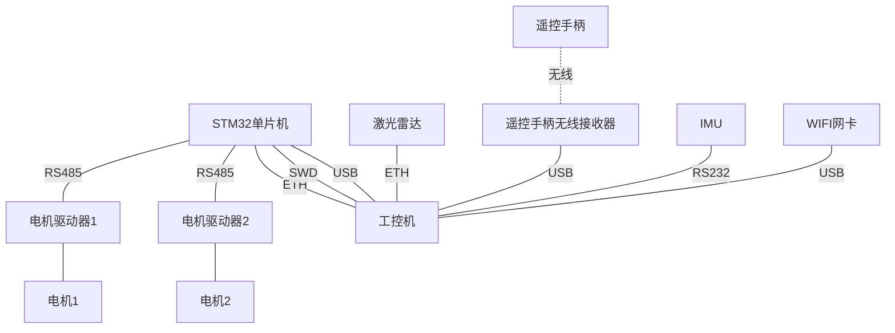
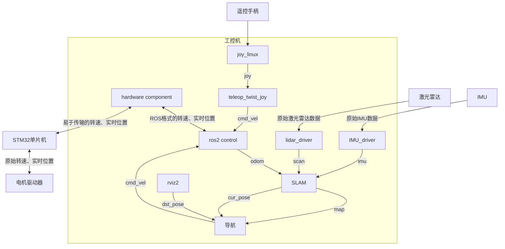

## 概述

我们在 [ROS1 建图和导航实战] 中使用的 ROS 版本为 ROS1 noetic，基于 Ubuntu 20.04, 使用的 SLAM 算法是 gmapping 和 cartographer，而导航算法是 navigation。在其中的“下一步计划”章节中，提到了“尝试 ROS2 及其新特性”，本文即是相应的尝试。本文使用的 ROS 版本为 ROS2 humble，基于 Ubuntu 22.04，SLAM 算法为 cartographer，导航算法为 nav2。

[ROS1 建图和导航实战]: 

ROS2 相关资源如下：
- ROS2 的设计论文：[Robot Operating System 2: Design, architecture, and uses in the wild \| Science Robotics](https://www.science.org/doi/10.1126/scirobotics.abm6074#sec-3)
- ROS2 各个组件的设计思想：[Design](https://design.ros2.org/)
- ROS2 命令行的参考手册：[ros2_cheats_sheet/cli/cli_cheats_sheet.pdf at master · ubuntu-robotics/ros2_cheats_sheet](https://github.com/ubuntu-robotics/ros2_cheats_sheet/blob/master/cli/cli_cheats_sheet.pdf)
- ROS2 命令行的参数详解：[ROS Command Line Arguments](https://design.ros2.org/articles/ros_command_line_arguments.html)
- ROS2 生命周期详解：[Managed nodes](https://design.ros2.org/articles/node_lifecycle.html)

gazebo 相关资源如下：
  - [Gazebo : Tutorial : Gazebo plugins in ROS](https://classic.gazebosim.org/tutorials?tut=ros_gzplugins#JointPoseTrajectory)
  - [Gazebo : Tutorial : URDF in Gazebo](https://classic.gazebosim.org/tutorials/?tut=ros_urdf)
  - [Gazebo : Tutorial : Installing gazebo_ros_pkgs (ROS 2)](https://classic.gazebosim.org/tutorials?tut=ros2_installing&cat=connect_ros#TestingGazeboandROS2integration)

此外，本次没有再使用 [ros-mobile-robots/diffbot](https://github.com/ros-mobile-robots/diffbot) 作为参考，主要使用 AI 基于核心文件生成相关代码，以便快速进行测试，同时保持项目的简洁性。本项目的源码参见 <https://github.com/wsxq2/nav_car>

## 硬件框图

本文使用的硬件和 [ROS1 建图和导航实战] 完全相同，硬件框图没有任何变化，但为了方便阅读，这里依然展示如下：



## 软件框图

由于 ROS2 和 ROS1 存在较大差异，所以本次实战的软件框图也和之前 ROS1 的存在较大差异，本次实战对应的软件框图如下所示：



其中遥控手柄走的无线链路，对端通过 USB 接收器接收其命令，USB 接收器插在 工控机的 USB 接口上，在 Ubuntu 系统中体现一个设备文件：`/dev/input/js0`。ROS2 组件中的 [joy_linux](https://index.ros.org/p/joy_linux/) 包提供了这类遥控手柄的底层驱动，即读取`/dev/input/js0`文件，然后发布 joy 主题。然后再由 [teleop_twist_joy](https://index.ros.org/p/teleop_twist_joy/) 包将该主题转换为 cmd_vel 主题，下发到 ros2 control，以实现小车的运动控制，即让小车“走”起来。

在 ROS2 中，运动控制主要由 ros2 control 框架负责，该框架要求实现一个 hardware component，以和底层硬件通信，完成相应的控制和状态获取。在这里，我们实现的 hardware component 将和 STM32 单片机进行通信，需要按照约定的通信协议进行编码。

ros2 control 会将读取的实时位置（转动的角度）转换为 odom 主题，提供给 SLAM 算法，SLAM 算法还会订阅激光雷达驱动发布 scan 主题，以及 IMU 驱动发布的 imu 主题，实现定位和建图，然后 SLAM 算法会将定位结果和建图结果提供给导航算法，导航算法会在这些信息的基础上结合从 rviz2 获取的目标位姿进行路径规划，完成后发布 cmd_vel 主题到 ros2 control，从而控制小车自动行走到目的地。

> 由于使用的工控机使用的模组是 NVIDIA Jetson Xavier NX，而官方没有提供 ubuntu 22.04 的系统镜像（最高仅支持到 ubuntu 20.04），因此我们使用了 docker，从而实现在 Ubuntu 20.04 上运行 Ubuntu 22.04 环境。
{: .prompt-warning }

## 单片机

单片机代码没有任何变化，这是因为我们约定了通信协议，分离了两个系统，只要协议正确即可通信。

## hardware component

这部分的代码可直接由 AI 生成，使用的提示词如下：

> 我需要完成 ROS2 control 中 hardware component 的代码，我的硬件只有两个使用转速方式控制的轮子，其通信接口为TCP，硬件是客户端，所以我需要写服务端，其监听地点0.0.0.0，端口号3011，接收连接后按照以下协议读取：
>
> | 字段          | 功能    | 数据类型  | 字节数 | 字节偏移 | 备注                        |
> |-------------|-------|-------|-----|------|---------------------------|
> | HEAD        | 帧头    | U16   | 2   | 0    | 固定为0x55AA                 |
> | LEN         | 帧长    | U16   | 2   | 2    | 单位为字节，整个帧的长度，不同命令的帧长不同    |
> | CMD         | 命令    | U8    | 1   | 4    | 0x02表示状态上报                |
> | MOTOR_LEFT  | 左电机转速 | INT32 | 4   | 5    | 单位为0.001rpm，向前时应为正        |
> | MOTOR_RIGHT | 右电机转速 | INT32 | 4   | 9    | 单位为0.001rpm，向前时应为正        |
> | POS_LEFT    | 左电机里程 | INT32 | 4   | 13   | 单位为0.001度                 |
> | POS_RIGHT   | 右电机里程 | INT32 | 4   | 17   | 单位为0.001度                 |
> | CRC16       | 校验    | U16   | 2   | 21   | 不包括帧头和自身,采用 MODBUS RTU 算法 |
> 
> 读取的内容在进行单位转换等处理后放置到相应的成员变量中，然后发送命令时同样需要进行单位转换等，然后通过以下协议发送到硬件：
> 
> | 字段        | 功能           | 数据类型 | 字节数 | 字节偏移 | 备注                                         |
> | ----------- | -------------- | -------- | ------ | -------- | -------------------------------------------- |
> | HEAD        | 帧头           | U16      | 2      | 0        | 固定为0x55AA                                 |
> | LEN         | 帧长           | U16      | 2      | 2        | 单位为字节，整个帧的长度，不同命令的帧长不同 |
> | CMD         | 命令           | U8       | 1      | 4        | 0x01表示运动控制                             |
> | MOTOR_LEFT  | 左电机转速     | INT32    | 4      | 5        | 单位为0.001rpm,向前时应为正                  |
> | MOTOR_RIGHT | 右电机转速     | INT32    | 4      | 9        | 单位为0.001rpm,向前时应为正                  |
> | RESET_ODOM  | 是否复位里程计 | U8       | 1      | 13       | 0: 不复位，1: 复位                           |
> | CRC16       | 校验           | U16      | 2      | 14       | 不包括帧头和自身,采用 MODBUS RTU 算法        |
> 
> 协议字节序均为大端。需要支持异常处理，网络断开时自动重连，并打印相关日志。

使用 Claude Sonnet 4 生成，生成的代码基本无需改动。

## ros2 control

ROS2 Control 框架的核心部分就两个：一个是前述的 hardware component，用于和硬件通信；另一个是 controller，即控制器，实现运动学的正逆解。

具体到我们的小车，需要使用的控制器即 [diff_drive_controller](https://control.ros.org/humble/doc/ros2_controllers/diff_drive_controller/doc/userdoc.html)。使用控制器的要点是正确编写其 YAML 配置文件，此次使用配置文件如下（基于 ROS1 做了些许修改）：

```yaml
controller_manager:
  ros__parameters:
    update_rate: 50  # Hz

    # Joint state broadcaster - broadcasts all joint states
    joint_state_broadcaster:
      type: joint_state_broadcaster/JointStateBroadcaster

    # Base swerve drive controller
    mobile_base_controller:
      type: diff_drive_controller/DiffDriveController

joint_state_broadcaster:
  ros__parameters:
    extra_joints: 
      - rear_caster_wheel_joint
      - rear_caster_rotation_joint

mobile_base_controller:
  ros__parameters:
    left_wheel_names: ["back_left_wheel_joint"]
    right_wheel_names: ["back_right_wheel_joint"]
    
    wheel_separation: 0.446  # Distance between left and right wheels (m)
    wheels_per_side: 1
    wheel_radius: 0.16      # Wheel radius (m)
    odom_frame_id: "odom"
    base_frame_id: "base_footprint"
    pose_covariance_diagonal: [0.01, 0.01, 0.001, 0.001, 0.001, 0.3]
    twist_covariance_diagonal: [0.01, 0.01, 0.001, 0.001, 0.001, 0.3]
    
    # Velocity and acceleration limits for the robot
    linear:
      x:
        has_velocity_limits    : true
        max_velocity           : 1.2   # m/s
        min_velocity           : -1.2  # m/s
        has_acceleration_limits: true
        max_acceleration       : 1.0   # m/s^2
        min_acceleration       : -1.0  # m/s^2
    angular:
      z:
        has_velocity_limits    : true
        max_velocity           : 3.14   # rad/s
        min_velocity           : -3.14  # rad/s
        has_acceleration_limits: true
        max_acceleration       : 3.14   # rad/s^2
        min_acceleration       : -3.14  # rad/s^2
```

## URDF

由于小车的机械结构未发生变化，所以 URDF 文件也无需发生实质性的修改，只需从 ROS1 移植到 ROS2 即可。如何移植呢？直接使用 AI 即可。

## 传感器标定

此次实战主要使用的传感器是激光雷达和里程计（IMU 暂未使用），激光雷达的外参和内参相比 ROS1 时均未发生变化，里程计由于重写了 hardware component，所以需要重新标定。标定过程和结果暂不详述。

## TF

和 ROS1 中的情形相同，主要涉及三部分 TF：`map->odom`, `odom->base_footprint`, `base_footprint->laser_link`及轮子相关 TF。其中`map->odom`由 cartographer 算法提供，`odom->base_footprint`由 ros2 control 中的 diff_drive_controller 提供，`base_footprint->laser_link`及轮子相关 TF 由 URDF 定义，然后由 ros2 control 中的 `joint_state_broadcaster/JointStateBroadcaster` 提供。

ROS2 中可使用 `ros2 run tf2_tools view_frames` 和 `ros2 run tf2_ros tf2_echo odom base_footprint` 等命令查看 TF 变换细节。

## SLAM

SLAM 算法主要使用 cartographer。有意思的是，ROS2 中内置了 cartographer，无需手动下载源码编译安装，即可以直接使用 apt 安装：

```bash
apt install ros-humble-cartographer ros-humble-cartographer-ros -y
```

正确使用 cartographer 的要点主要有两个部分：一是要保证传感器输入是合理的；二是要保证 lua 配置（cartographer 使用 lua 文件作为配置文件）是合理的。这里说的是“合理”而非“正确”，这是因为“正确”要求太高了，且通常没有绝对的正确。cartographer 的输入只有激光雷达是必须的，其他都是可选的，但这次我们用到了里程计，所以里程计也是重要的输入。通常在完成前述的“传感器标定”后，输入就应该是合理的了。所以配置文件才是重点。

配置文件方面，我们直接采用了 ROS1 实战中的配置，发现是可用的，这是极好的，避免花费大量时间调整参数。

## 导航

ROS2 中的导航框架是 [nav2]，这是一个非常牛的框架，功能非常强大，相比 ROS1 的 navigation 而言，它的模块化做得更好，且引入了许多优秀的组件，如行为树等，从而具备极强的自定义能力，包括但不限于导航到目标位姿、沿着指定点到目标位姿、跟随指定路径、跟随指定目标、自动去充电、在轨道图中导航。总之，几乎所有地面上的运动及相关的任务都可以交给 [nav2] 来完成，其可拓展性非常强，因为引入了行为树。

[nav2] 提供了完善的文档，且其内容非常丰富，不仅描述了 nav2 本身，还描述了许多相关的其他概念。我通读完官方文档后感觉受益匪浅，个人感觉以下章节比较重要：

1. [Getting Started](https://docs.nav2.org/getting_started/index.html)：如何安装 nav2，以及如何运行 nav2 内置示例
2. [Navigation Concepts](https://docs.nav2.org/concepts/index.html)：关键概念和思想，这个章节非常重要。务必精读。其中关于行为树的外部链接（一篇论文）让我印象深刻。
3. [Configuration Guide](https://docs.nav2.org/configuration/index.html)：配置指南，无需细看，作为参考手册阅读即可。
4. [Nav2 Behavior Trees](https://docs.nav2.org/behavior_trees/index.html)：建议精读。另外建议读一下其中提到的 [BehaviorTree.CPP](https://www.behaviortree.dev/) 的官方文档。
5. [Navigation Plugins](https://docs.nav2.org/plugins/index.html)：粗读即可。可作为插件源码的参考手册。
6. [Simple Commander API](https://docs.nav2.org/commander_api/index.html)：建议精读。这个章节阐述了 nav2 实现了一个方便的 python api，用于组合出复杂的任务。感觉和行为树是类似的，或许是二选一的关系？

一些阅读心得：
- 关于行为树：行为树是对 FSM（有限状态机） 的替代，它的优点是更加模块化，更容易实现复杂的响应式任务。行为树在 [Behavior Trees in Robotics and AI———An Introduction](https://arxiv.org/pdf/1709.00084) 中有详细说明（阅读第 1 章节就足够了），一个比较知名的 C++ 库是 [BehaviorTree.CPP](https://www.behaviortree.dev/)，nav2 中也使用了该库，且对其进行了一定程度的封装，以便在 nav2 中使用。nav2 中提供了大量的行为树节点， 主要包括 4 类：Action、Condition、Control、Decorator，其中 Action 插件是最多的，以便于用户使用。在 nav2 中，由于使用了 BehaviorTree.CPP 库，行为树使用 xml 文件表达。行为树的使用主要通过 Behavior-Tree Navigator 来完成，它有两个设置行为树 xml 文件路径的参数：`default_nav_to_pose_bt_xml`和`default_nav_through_poses_bt_xml`，设置后可改变发送 action `/navigate_to_pose` 后 nav2 的行为，除此之外，`/navigate_to_pose`这个 action server 本身也能接收行为树 xml 文件路径，使用`ros2 interface show nav2_msgs/action/NavigateToPose`命令后可以看到它有个参数`behavior_tree`，在这里可以指定 xml 文件的绝对路径，同样能生效。
- 关于状态估计：nav2 中的状态估计其实就是“位姿估计”，即“定位”。涉及两个层次，一个是基于里程计的，另一个是基于扫描匹配的，二者可以融合得到最终的位姿估计，基于里程计的又可以使用 [robot_localization](https://docs.ros.org/en/noetic/api/robot_localization/html/index.html) 融合 IMU、GPU 等传感器数据。基于扫描匹配的包括 AMCL 这种纯定位算法，也包括 SLAM 中的纯定位模式，或者直接就是 SLAM，边建图边定位。基于扫描匹配的定位算法通常会将里程计数据作为输入，再结合激光雷达扫描结果进行整合，输出最终定位结果。
- 如何实现跟随：参阅 [Dynamic Object Following — Nav2 1.0.0 documentation](https://docs.nav2.org/tutorials/docs/navigation2_dynamic_point_following.html)，注意需要设置`default_nav_to_pose_bt_xml`参数或者修改 action 中的`behavior_tree` 参数。
- 如何使用 rviz2 中的 Nav Through Poses 和 Waypoint Following？参见 [【ROS2机器人入门到实战】进行单点与路点导航_ros导航点添加-CSDN博客](https://blog.csdn.net/qq_27865227/article/details/132640835)

[nav2]: https://docs.nav2.org/index.html

回到我们的小车上面来，要使用 [nav2] 完成其基本的功能——导航到目标位姿，我们需要做什么呢？我们只需要写配置文件。我们不需要从头写，根据官方配置文件做一些调整就可以。修改如下所示：

```diff
diff -u /opt/ros/humble/share/nav2_bringup/params/nav2_params.yaml src/navcar_navigation/config/nav2_params.yaml 
--- /opt/ros/humble/share/nav2_bringup/params/nav2_params.yaml  2025-02-06 09:23:01.000000000 +0800
+++ src/navcar_navigation/config/nav2_params.yaml       2025-09-29 15:30:47.989479510 +0800
@@ -14,8 +14,8 @@
     global_frame_id: "map"
     lambda_short: 0.1
     laser_likelihood_max_dist: 2.0
-    laser_max_range: 100.0
-    laser_min_range: -1.0
+    laser_max_range: 25.0
+    laser_min_range: 0.15
     laser_model_type: "likelihood_field"
     max_beams: 60
     max_particles: 2000
@@ -183,7 +184,7 @@
 local_costmap:
   local_costmap:
     ros__parameters:
-      update_frequency: 5.0
+      update_frequency: 1.0
       publish_frequency: 2.0
       global_frame: odom
       robot_base_frame: base_link
@@ -192,12 +193,12 @@
       width: 3
       height: 3
       resolution: 0.05
-      robot_radius: 0.22
+      robot_radius: 0.6
       plugins: ["voxel_layer", "inflation_layer"]
       inflation_layer:
         plugin: "nav2_costmap_2d::InflationLayer"
         cost_scaling_factor: 3.0
-        inflation_radius: 0.55
+        inflation_radius: 0.6
       voxel_layer:
         plugin: "nav2_costmap_2d::VoxelLayer"
         enabled: True
@@ -214,9 +215,9 @@
           clearing: True
           marking: True
           data_type: "LaserScan"
-          raytrace_max_range: 3.0
+          raytrace_max_range: 25.0
           raytrace_min_range: 0.0
-          obstacle_max_range: 2.5
+          obstacle_max_range: 25.0
           obstacle_min_range: 0.0
       static_layer:
         plugin: "nav2_costmap_2d::StaticLayer"
@@ -231,7 +232,7 @@
       global_frame: map
       robot_base_frame: base_link
       use_sim_time: True
-      robot_radius: 0.22
+      robot_radius: 0.6
       resolution: 0.05
       track_unknown_space: true
       plugins: ["static_layer", "obstacle_layer", "inflation_layer"]
@@ -255,7 +256,7 @@
       inflation_layer:
         plugin: "nav2_costmap_2d::InflationLayer"
         cost_scaling_factor: 3.0
-        inflation_radius: 0.55
+        inflation_radius: 0.6
       always_send_full_costmap: True
 
 map_server:
```

可以看到，基本都是和机器人有关的或者是和激光雷达有关的修改，也比较容易理解。这样一改后，就可以直接用了。

一些发现：
- 单个障碍物能正确躲避，且尝试5次以上未发生碰撞，比 ROS1 的情况要好。但某些极限情况下还是会碰撞
- 地图上点击 local 障碍物目标点，它会纠正目标点为在障碍物前
- 地图上点击 global 障碍物目标点，它会规划失败
- 响应比 ROS1 快，移动更流畅
- 地图上给定不可达目标点（障碍物较多），它会尝试多次后放弃
- Rviz2 上现在有个 navigation 专用的界面，导航期间上面有取消按钮，ROS1时没有。此外 Reset 按钮会将初始位置恢复到初始状态，此时需要手动重定位

一些注意事项：
- 一定要确保 `/scan` 主题在发布激光雷达数据，因为 nav2 使用该主题获取激光雷达数据。建议使用 `ros2 topic echo /scan -1` 来查看是否有数据。如果使用 rviz2，要注意发布相关 tf，例如发布 `base_link->laser_link` 的 tf（注意确认你的 laser_link 是否叫这个名字），然后在 rviz2 中设置 Global Frame，如果没有发布任何 tf，则 rviz2 中会显示未接收到激光雷达数据。出于测试考虑，可以使用以下命令发布前述 tf：
  
  ```bash
  ros2 run tf2_ros static_transform_publisher --frame-id base_link --child-frame-id laser_link
  ```
  
  这会发布全为 0 的变换，即两个 frame 会重合。然后在 rviz2 中你就可以任选一个作为 Global Frame。

- Nav2 在 ros2 humble 中默认使用 `Twist` 而非 `TwistStamped` 消息，虽然[官方文档](https://docs.nav2.org/configuration/packages/configuring-behavior-server.html)说可以设置参数
  `enable_stamped_cmd_vel` 为 `true` 将其调整为 `TwistStamped` 型消息，但尝试后未成功，即使我设置了 [Behavior Server](https://docs.nav2.org/configuration/packages/configuring-behavior-server.html)、[Controller Server](https://docs.nav2.org/configuration/packages/configuring-controller-server.html)、[Velocity Smoother](https://docs.nav2.org/configuration/packages/configuring-velocity-smoother.html)。所以最后我只能修改摇杆和底盘控制器的配置：

  ```yaml
  publish_stamped_twist: false # for joystick
  use_stamped_vel: false # for DiffDriveController
  ```

一些经验总结：

- 对于 ros2 包，我想要在构建 docker 容器时安装相应依赖，如何优雅地完成？可以先 clone 代码，然后执行 rosdep 命令安装该项目的所有依赖，再删除代码，后续使用 docker 的 volume bind 保存代码的修改。详见项目中的 [Dockerfile](https://github.com/wsxq2/nav_car/blob/humble/docker/Dockerfile) 及相关文件。
- 清理 `package.xml` 中的依赖，使其仅包含必要的依赖，且尽量只写最上层的依赖，而非列出所有依赖这是更好的设计，可以提高 `rosdep` 命令安装依赖的效率。比如某个包依赖包 x，而 x 依赖 a 和 b，那么只写 x 即可，不写 a 和 b。
- `package.xml` 中的包名如何正确填写？参见 <https://docs.ros.org/en/humble/Tutorials/Intermediate/Rosdep.html#how-do-i-know-what-keys-to-put-in-my-package-xml>
- 对于 `rosdep` 找不到的依赖（比如激光雷达镭神 M10 的驱动），建议优先使用官方在 GitHub 或者类似地方发布的驱动代码，但不要直接复制到你的项目中，而是使用 git 的 submodule 功能将其作为外部模块引入，也不要修改官方代码或配置，方便后续升级。如果官方配置需要修改以适应你的机器人，你可以新建一个包（如 navcar_lidar） 来保存你的配置。关于 `git submodule` 的使用其实非常简单，常用的只有 `add` 子命令和 `update` 子命令，例如：
  
  ```bash
  git submodule add -b M10/M10-PHY_V1.0 https://github.com/Lslidar/Lslidar_ROS2_driver.git src/lslidar_driver
  git submodule update --init
  ```
  
  如果 clone 时想要一键克隆所有 submodule，则可以使用`--recurse-submodules`参数，如下所示：

  ```bash
  git clone --recurse-submodules https://github.com/wsxq2/nav_car.git
  ```

- 激光雷达的 `frame_id` 一定要一致，包括在驱动中、在 nav2 中、在 URDF 中，否则就会失败。
- nav2 的 `nav2_bringup` 包很有用，里面有许多可复用的 launch 文件，本项目也复用了其 launch 文件 `/opt/ros/humble/share/nav2_bringup/launch/bringup_launch.py`。
- nav2 中 `map_server` 组件的配置中，`yaml_filename` 这项配置一定要写，哪怕设置为空（`""`），否则 `/opt/ros/humble/share/nav2_bringup/launch/bringup_launch.py` 文件中使用的 `RewrittenYaml` 就无法覆写此参数，导致其未设置，从而启动 `map_server` 失败。这里我被坑惨了，当时还以为是 launch 文件写得有问题，折腾很久才明白核心问题出在这里。这也体现了 `RewrittenYaml` 的局限性。
- 各个 topic 要和 nav2 中的设置保持一致，建议直接使用 nav2 的默认值，如 `/cmd_vel`、`/odom`、`/scan` 等，否则 remap 还有点麻烦，尤其是 `/cmd_vel`，因为它有许多订阅者。

## 遇到过的问题

1. 在 Windows 上远程桌面（rdp）时，对端 Ubuntu 经常自动锁屏，从而需要输入密码？

   设置中关闭自动锁屏功能即可（Settings->Privacy->Screen->Automatic Screen Lock）

1. 通过 ssh 访问方式访问 github 的 repo 时，在执行 `git push` 命令后会卡死？

   1. 尝试了 ssh 的代理，即在 `~/.ssh/config` 中添加类似 `ProxyCommand nc -X connect -x 192.168.3.107:7890 %h %p`的配置，但效果不大（准确地说，是没有任何效果）。
   1. 最终发现在 vscode 中，通过 HTTPS 方式访问 github 的 repo，在执行`git push`后无需输入密码，且可正常使用代理，所以后续可以使用 vscode。无需输入密码的原因是 vscode 自动处理了认证，详见[Using Git source control in VS Code](https://code.visualstudio.com/docs/sourcecontrol/overview?originUrl=%2Fdocs%2Fsourcecontrol%2Foverview) 和 `git config -l` 输出中的如下内容：

      ```
      credential.helper=!f() { /home/dev/.vscode-server/bin/dfaf44141ea9deb3b4096f7cd6d24e00c147a4b1/node /tmp/vscode-remote-containers-5e5ecc7c-9ab1-4d29-a4c3-529026230425.js git-credential-helper $*; }; f
      ```
      
   1. 如果没有使用 vscode 的条件，且既希望不卡又能安全地进行认证，则可以使用 github 官方的 token 方式认证 HTTPS repo，token 方式有两种：局部的和全局的。前者可以设定授予的具体权限，如创建一个指定 repo 能 push 的 token，由于其粒度较细，所以官方更推荐。后者则具有整个用户的所有权限，如对当前用户任意 repo 的 push 权限。详见 [Managing your personal access tokens - GitHub Docs](https://docs.github.com/en/authentication/keeping-your-account-and-data-secure/managing-your-personal-access-tokens#using-a-personal-access-token-on-the-command-line)。

1. 在开发过程中，使用了 docker 搭建开发环境（结合了 VSCode 的 dev container 和 docker compose），但一开始使用的是 X86_64 的台式机，所以构建的容器也是 X86_64 平台的，但实际运行平台是 ARM64（jetson），因此，为了尽可能还原工控机的环境，需要让 docker compose 支持多平台构建。docker 官方对此提供了完善的支持，详见以下链接：

   1. [Multi-platform \| Docker Docs](https://docs.docker.com/build/building/multi-platform/)。需要注意每次运行前需要执行`docker run --privileged --rm tonistiigi/binfmt --install all`以启动虚拟化环境，否则会报错 `exec format error`。可以添加相应服务到 docker-compose.yaml 文件中，如下所示：

      ```yaml
      name: navcar-${USER}
      services:
        emulator:
          image: tonistiigi/binfmt
          privileged: true
          command: --install arm64
          network_mode: bridge
          restart: "no"
        navcar-dev:
          depends_on:
            - emulator
          build:
          ...
      ```
   1. [docker-compose.yaml 中指定构建平台](https://docs.docker.com/reference/compose-file/build/#platforms)
   1. [docker-compose.yaml 中指定运行平台](https://docs.docker.com/reference/compose-file/services/#platform)

1. 多个用户使用同一主机上的 docker compose 进行同一项目的开发时，需要将项目名取为不同的名称，否则会冲突。可在项目名中直接使用`USER`环境变量以作区分，如：
   
   ```yaml
   name: navcar-${USER}
   services:
     navcar-dev:
     ...
   ```

1. ROS2 跨 docker 容器和主机如何进行通信？具体情形描述如下：一个 ROS2 运行于 arm64 工控机（jetson）上的 Docker 容器中，另一个 ROS2 直接运行于 x86_64 架构的 PC 上，两边均是 Ubuntu 22.04 系统。

   其实非常简单，满足以下条件即可：
   1. docker 容器在启动时设置`--net=host`（或者在 docker-compose.yaml 中做相应配置）
   2. 让工控机和 PC 处于同一局域网
   3. 让两边的环境变量`ROS_DOMAIN_ID`相同
   4. 让两边的环境变量`ROS_LOCALHOST_ONLY`为 0
   
   遇到问题时，可以使用 `ros2 multicast send/receive` 进行粗测，再使用例程 `ros2 run demo_nodes_cpp listener/talker`细测。如果两者都可以的话，说明就是 OK 的。
   
   注意，即使OK了，`ros2 topic list` 命令也不会列出对端的 topic，这是为了降低带宽，仅在有人订阅时才进行相应的通信（进行通信后方可使用前述命令查看到对端的 topic）。
   
   另可参见 [吃灰树莓派第二篇\|不设置主从机，看ROS2如何进行多机通信_ros2通讯延迟、测试-CSDN博客](https://blog.csdn.net/qq_27865227/article/details/120257395)。
   
   如果通信不稳定，可以考虑 [Using Fast DDS Discovery Server as discovery protocol \[community-contributed\] — ROS 2 Documentation: Humble documentation](https://docs.ros.org/en/humble/Tutorials/Advanced/Discovery-Server/Discovery-Server.html)

1. 关于 joystick（手柄）的底层驱动，我应该选择 [joy](https://index.ros.org/p/joy/) 包还是 [joy_linux](https://index.ros.org/p/joy_linux/) 包？
   
   前者使用的是 Linux 中的事件设备，例如`/dev/input/event1`，后者使用的是 Linux 中的 js 设备，例如`/dev/input/js0`，所以看实际情况做出正确的选择。
   
   相关依据参见[源码](https://github.com/ros-drivers/joystick_drivers/blob/881f3a5474044b79324a2117fe52a5db2106e4e0/joy_linux/src/joy_linux_node.cpp#L211) 和 [ROS Package: joy](https://index.ros.org/p/joy/) 中的“Technical note”章节。

1. 遥控手柄无法控制小车？
   
   遥控手柄控制小车涉及多个环节，需要逐层排查，务必戒骄戒躁。可按以下步骤进行：
   1. 先尝试 `jstest` 命令（该命令可通过 `sudo apt install joystick` 获得），检查`/dev/input/js0`是否能正常接收数据。如果加`sudo`才可以，则需要给当前用户添加相应的权限，比如`sudo chown dev:dev /dev/input/js0`
   2. 能正常接收后，再尝试 joy 包或者 joy_linux 包，或者其他相关包，看能否正确发布 joy 主题
   3. 如果可以，再尝试 teleop_twist_joy 包，看能否正确发布 cmd_vel 主题
   
   另请参见 <https://wiki.ros.org/joy/Troubleshooting>

1. 使用 vscode + dev container 时如何避免自动复制 `.gitconfig`？具体描述如下：我使用的是 windows 笔记本，使用 vscode 通过 remote ssh 连接到远程的 Linux 主机（Ubuntu 系统），然后再在 vscode 中点击“Reopen folder in Container”，这时 windows 上的 .gitconfig 会被复制到容器中。
   
   可以通过修改 windows 上 vscode 的设置关闭此行为，该设置项为`dev.containers.copyGitConfig`

1. 如何查看解析 `.env` 文件后的 docker-compose.yaml？
   
   `docker compose config` 可以查看解析 `.env` 文件之后的版本，添加 `--environment` 可以查看会导入到容器的所有环境变量

1. `ros2 node list` 无数据且 `ros2 topic list -v` 显示未知的节点？
   
   重启 ros2 daemon 或者添加`--no-daemon`参数，详见 [The command "ros2 node list" did not display any nodes · Issue #1616 · ros2/ros2](https://github.com/ros2/ros2/issues/1616#issuecomment-2450545244)

1. `std::reference_wrapper`是什么？有何用途？

   它来存储引用，解决原本的引用无法在类（或结构体）成员中定义的问题，它有点类似指针，但使用时必须正确初始化，否则会报编译错误，从而保证其永远不为空，但可能引用无效存储，成为“悬挂引用”
  
1. `std::move`是什么，有何作用？

   高效传递资源，避免拷贝，详见 [std::move - cppreference.com](https://en.cppreference.com/w/cpp/utility/move.html)。

1. `vector::empace_back`是什么，有何作用？

   使用右值引用放置 item 到 vector 中，减少 copy，提高效率，详见[std::vector<T,Allocator>::emplace_back - cppreference.com](https://en.cppreference.com/w/cpp/container/vector/emplace_back)

1. `colcon`可以配置其行为吗？

   可以。有三种配置文件：包目录中的`colcon.pkg`、工作空间或家目录下的`.meta`、工作空间或家目录下的`defaults.yaml`，前两者均和包相关，对特定包进行配置，后者则可以进行全局配置，且支持对各个子命令进行配置，详见 [Configuration — colcon documentation](https://colcon.readthedocs.io/en/released/user/configuration.html)

1. `colcon test-reulst`命令得到的结果中，skipped 的数量不正确，尤其是对于 humble 版本下的 GTEST_SKIP?
   
   是官方 bug，未找到解决方案，详见 [colcon test-result 'skipped' count is inaccurate · Issue #18 · colcon/colcon-test-result](https://github.com/colcon/colcon-test-result/issues/18)

2. 在 WSL2 中使用 ROS2 无法使用镜像网络模式？即使更新 WSL 后？和[这个 issue](https://github.com/microsoft/WSL/issues/12351) 描述的问题相同，但我使用的操作系统是 Windows 11 家庭版 24H2
   
   解决方法参见其中的一个[评论](https://github.com/microsoft/WSL/issues/12351#issuecomment-2726198648) ：在“启用或关闭Windows功能”中启用“Windows虚拟机监控程序平台”，另外也要启用“Virtual Machine Platform”、“适用于Linux的Windows子系统”。
   
   AI(Gemini) 说镜像网络模式只能在支持 Hyper-V 的 Windows 11（专业版及以上版本）上使用，实际并非如此，启用“Windows虚拟机监控程序平台”即可使用。
   
   后续发现执行 `ros2 topic list` 显示不出来结果，有点奇怪。后来发现执行`ros2 daemon start`后就可以了。
   
   > `wslinfo --networking-mode`在 WSL 中执行后可以知道当前使用的网络模式（之前未启用“Windows虚拟机监控程序平台”时是 `none`）。关于镜像网络模式可参考[官方文档](https://learn.microsoft.com/en-us/windows/wsl/networking#mirrored-mode-networking)。另外建议参阅 [espenakk/ros2-wsl2-guide: A guide to configuring WSL2 for using ROS2 on Windows 11](https://github.com/espenakk/ros2-wsl2-guide)，它提供了完整的教程
   {: .prompt-tip }

1. 多平台构建在 win11 的 docker desktop 上无法使用，尤其是在构建 arm64 镜像时，会报错
`qemu: uncaught target signal 11 (Segmentation fault) - core dumped`? 详细报错如下：

   ```
   ...
   97.17 Processing triggers for libc-bin (2.35-0ubuntu3.10) ...
   97.24 qemu: uncaught target signal 11 (Segmentation fault) - core dumped
   97.98 Segmentation fault (core dumped)
   98.02 qemu: uncaught target signal 11 (Segmentation fault) - core dumped
   98.73 Segmentation fault (core dumped)
   98.74 dpkg: error processing package libc-bin (--configure):
   98.74  installed libc-bin package post-installation script subprocess returned error exit status 139
   98.80 Errors were encountered while processing:
   98.80  libc-bin
   98.92 E: Sub-process /usr/bin/dpkg returned an error code (1)
   ...
   ```

   进一步地，只有当 docker 镜像为 ubuntu 22.04 时会有此问题，24.04 和 20.04 均无此问题，详见 [Segmentation fault when using Docker Desktop to call an arm64 Ubuntu image. · Issue #12834 · microsoft/WSL](https://github.com/microsoft/WSL/issues/12834)
   
1. gazebo URDF中的摩擦系数等如何设置？

   参考以下链接：
   - [urdf/Tutorials/Adding Physical and Collision Properties to a URDF Model - ROS Wiki](https://wiki.ros.org/urdf/Tutorials/Adding%20Physical%20and%20Collision%20Properties%20to%20a%20URDF%20Model)
   - [Friction - Coefficients for Common Materials and Surfaces](https://www.engineeringtoolbox.com/friction-coefficients-d_778.html)
   - [Gazebo : Tutorial : Physics Parameters](https://classic.gazebosim.org/tutorials?tut=physics_params&cat=physics#Frictionparameters)

1. 如何在 ros2_control 中实现 joint_limits？

   暂未找到好方法。可参考 [Will the joint limits in my URDF file limit the real components or just the simulation? (ROS2: Foxy) : r/ROS](https://www.reddit.com/r/ROS/comments/xpi234/will_the_joint_limits_in_my_urdf_file_limit_the/)
